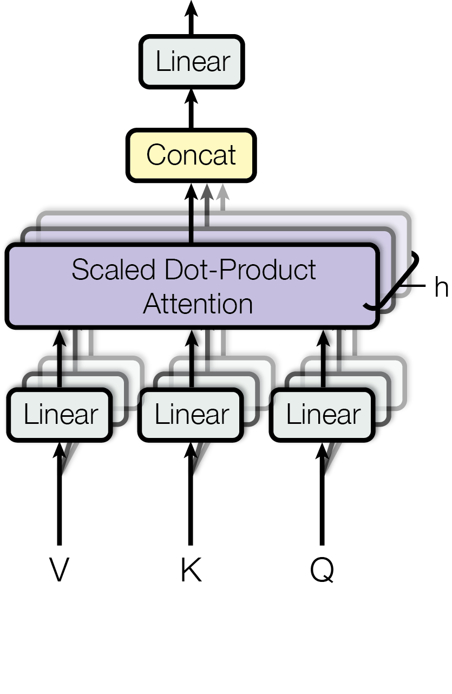
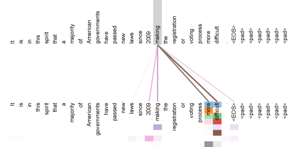
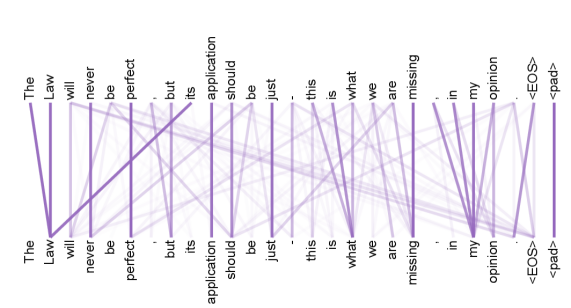

# Attention Is All You Need — 中文翻译

> 原论文：Ashish Vaswani, Noam Shazeer, Niki Parmar, Jakob Uszkoreit, Llion Jones, Aidan N. Gomez, Łukasz Kaiser, Illia Polosukhin
> Google Brain / Google Research / University of Toronto
> arXiv:1706.03762v7
> 翻译仅供学习参考

---

## 摘要

主流的序列转换模型都是基于复杂的**循环神经网络**或**卷积神经网络**，包含一个编码器和一个解码器。表现最好的模型还会通过**注意力机制**将编码器和解码器连接起来。

我们提出了一种新的、简单的网络架构——**Transformer**，完全基于注意力机制，彻底抛弃了循环和卷积。在两个机器翻译任务上的实验表明，这些模型在质量上更优，同时更具并行性，训练所需时间显著减少。

我们的模型在 **WMT 2014 英德翻译**任务上达到了 **28.4 BLEU**，比之前的最佳结果（包括集成模型）提高了 2 BLEU 以上。在 **WMT 2014 英法翻译**任务上，我们的模型在 8 个 GPU 上训练 **3.5 天**后，创下了 **41.8 BLEU** 的单模型新纪录，训练成本仅为文献中最佳模型的一小部分。

我们还展示了 Transformer 能很好地泛化到其他任务——在**英语成分句法分析**上成功应用，无论训练数据是多是少。

---

## 1 引言

**循环神经网络**，尤其是 **LSTM** [13] 和 **GRU** [7]，已经在序列建模和转换问题（比如语言建模和机器翻译）中被确立为最先进的方法 [35, 2, 5]。之后大量的工作继续推动循环语言模型和编码器-解码器架构的边界 [38, 24, 15]。

循环模型通常沿着输入和输出序列的符号位置来分解计算。将位置与计算时间的步骤对齐，它们生成一系列隐藏状态 $h_t$，作为前一个隐藏状态 $h_{t-1}$ 和位置 $t$ 的输入的函数。这种**固有的顺序性质**阻碍了训练样本内部的并行化，在序列较长时这个问题尤为严重，因为内存限制会限制跨样本的批处理。

近期的工作通过**因式分解技巧** [21] 和**条件计算** [32] 在计算效率上取得了显著提升，后者还提升了模型性能。但**顺序计算的根本限制依然存在**。

**注意力机制**已经成为各种任务中序列建模和转换模型的重要组成部分，允许建模时不考虑输入或输出序列中的距离 [2, 19]。但在几乎所有情况下 [27]，这种注意力机制都与循环网络结合使用。

在这项工作中，我们提出了 **Transformer**——一种摒弃循环、完全依赖注意力机制来获取输入和输出之间全局依赖关系的模型架构。Transformer 允许显著的更多并行化，在 8 个 P100 GPU 上训练仅 **12 小时**就能达到翻译质量的新水平。

---

## 2 背景

减少顺序计算的目标也是 **Extended Neural GPU** [16]、**ByteNet** [18] 和 **ConvS2S** [9] 的基础，它们都使用卷积神经网络作为基本构建块，对所有输入和输出位置并行计算隐藏表示。

在这些模型中，关联两个任意输入或输出位置所需的操作数随着位置之间的距离增长——ConvS2S 是**线性增长**，ByteNet 是**对数增长**。这使得学习远距离位置之间的依赖关系更加困难 [12]。

> 在 Transformer 中，这个操作数被降到了 **O(1) 常数级别**，代价是注意力加权位置的平均化导致有效分辨率降低——我们用 **Multi-Head Attention**（多头注意力）来抵消这个影响，见 3.2 节。

**自注意力**（Self-attention），有时也叫内部注意力（intra-attention），是一种将**单个序列**的不同位置关联起来以计算序列表示的注意力机制。自注意力已成功应用于多种任务，包括阅读理解、抽象摘要、文本蕴含和学习任务无关的句子表示 [4, 27, 28, 22]。

**端到端记忆网络**基于循环注意力机制而非序列对齐的循环，在简单语言问答和语言建模任务上表现良好 [34]。

据我们所知，**Transformer 是第一个完全依赖自注意力**来计算输入和输出表示的转换模型，不使用序列对齐的 RNN 或卷积。

---

## 3 模型架构


**Figure 1:** Transformer 模型架构。左边是编码器，右边是解码器。

大多数有竞争力的神经序列转换模型都有**编码器-解码器**结构 [5, 2, 35]。编码器将输入序列 $(x_1, ..., x_n)$ 映射为连续表示序列 $\mathbf{z} = (z_1, ..., z_n)$。给定 $\mathbf{z}$，解码器逐个生成输出序列 $(y_1, ..., y_m)$。每一步模型都是**自回归的** [10]，生成下一个符号时会将之前生成的符号作为额外输入。

Transformer 遵循这个整体架构，编码器和解码器都使用**堆叠的自注意力**和**逐位置全连接层**，分别如图 1 的左右两半所示。

---

### 3.1 编码器和解码器堆叠

#### 编码器

编码器由 **N=6 个相同层**堆叠而成。每层有两个子层：

1. **多头自注意力机制**（Multi-Head Self-Attention）
2. **逐位置全连接前馈网络**（Position-wise Feed-Forward Network）

每个子层周围都使用了**残差连接** [11]，然后进行**层归一化** [1]。即每个子层的输出为：

```
LayerNorm(x + Sublayer(x))
```

为了方便残差连接，模型中所有子层以及嵌入层的输出维度都是 **d_model = 512**。

#### 解码器

解码器也由 **N=6 个相同层**堆叠而成。除了编码器中的两个子层外，解码器还插入了**第三个子层**——对编码器堆叠输出执行多头注意力。

与编码器类似，我们使用残差连接和层归一化。我们还修改了解码器中的自注意力子层，**防止位置关注后续位置**。这种 **mask（掩码）** 结合输出嵌入偏移一个位置的事实，确保位置 $i$ 的预测只能依赖于位置 $i$ 之前已知输出。

---

### 3.2 注意力

注意力函数可以描述为：将一个**查询（Query）**和一组**键值对（Key-Value pairs）**映射到一个输出。输出是值的加权和，权重由查询与对应键的兼容性函数计算。

#### 3.2.1 缩放点积注意力（Scaled Dot-Product Attention）


我们称我们的注意力为"**缩放点积注意力**"（Figure 2 左）。输入包括维度为 $d_k$ 的查询和键，以及维度为 $d_v$ 的值。

计算过程：

```
1. 计算查询与所有键的点积
2. 除以 √d_k
3. 应用 softmax 得到权重
4. 用权重对值加权求和
```

公式：

$$\text{Attention}(Q, K, V) = \text{softmax}\left(\frac{QK^T}{\sqrt{d_k}}\right)V \quad (1)$$

两种最常用的注意力函数是：

| 类型 | 原理 | 特点 |
|------|------|------|
| **加性注意力**（Additive Attention） | 用带一个隐藏层的前馈网络计算兼容性 | 理论复杂度类似 |
| **点积注意力**（Dot-Product Attention） | 直接计算点积 | 更快，更省空间 |

> 为什么需要缩放？当 $d_k$ 较大时，点积的量级会变得很大，把 softmax 推入梯度极小的区域。直观理解：假设 $q$ 和 $k$ 的各分量是均值为 0、方差为 1 的独立随机变量，那它们的点积 $q \cdot k = \sum_{i=1}^{d_k} q_i k_i$ 的均值为 0、方差为 $d_k$。所以需要除以 $\sqrt{d_k}$ 来缩放。

#### 3.2.2 多头注意力（Multi-Head Attention）



不是用 $d_{\text{model}}$ 维度的键、值和查询执行单个注意力函数，而是发现这样做更好：

```
1. 用不同的、可学习的线性投影，将 Q、K、V 分别投影 h 次
   - 投影到 d_k, d_k, d_v 维度
2. 对每个投影版本并行执行注意力函数
3. 得到 h 个 d_v 维的输出
4. 拼接（Concat）
5. 再做一次线性投影得到最终结果
```

公式：

$$\text{MultiHead}(Q, K, V) = \text{Concat}(\text{head}_1, ..., \text{head}_h)W^O$$

其中：

$$\text{head}_i = \text{Attention}(QW_i^Q, KW_i^K, VW_i^V)$$

投影矩阵：$W_i^Q \in \mathbb{R}^{d_{\text{model}} \times d_k}$，$W_i^K \in \mathbb{R}^{d_{\text{model}} \times d_k}$，$W_i^V \in \mathbb{R}^{d_{\text{model}} \times d_v}$，$W^O \in \mathbb{R}^{hd_v \times d_{\text{model}}}$

> **本工作中**：h = **8** 个并行注意力头。每个头 $d_k = d_v = d_{\text{model}} / h = 64$。由于每个头的维度降低了，**总计算量与全维度的单头注意力相近**。

**多头注意力的意义**：让模型能同时关注**不同表示子空间**中**不同位置**的信息。如果只有一个注意力头，平均化会抑制这种能力。

#### 3.2.3 注意力在 Transformer 中的三种应用

Transformer 中多头注意力以**三种不同方式**使用：

1. **编码器-解码器注意力层**
   - 查询来自上一层解码器
   - 键和值来自编码器输出
   - 让解码器的每个位置都能关注输入序列的所有位置
   - 类似传统 seq2seq 中的编码器-解码器注意力

2. **编码器自注意力层**
   - Q、K、V 全部来自编码器前一层的输出
   - 编码器每个位置可以关注前一层的所有位置

3. **解码器自注意力层**
   - 允许解码器中每个位置关注到该位置及之前的所有位置
   - **必须防止向左的信息流**（保持自回归特性）
   - 实现方式：在 softmax 输入中将非法连接对应的值设为 $-\infty$（掩码）

---

### 3.3 逐位置前馈网络

每个编码器和解码器层除了注意力子层外，还包含一个**全连接前馈网络**，对每个位置**独立且相同地**应用。

结构就是两层线性变换，中间加一个 **ReLU**：

$$\text{FFN}(x) = \max(0, xW_1 + b_1)W_2 + b_2 \quad (2)$$

不同位置用相同的变换，但**不同层用不同的参数**。也可以理解为 kernel size = 1 的两个卷积。

- 输入输出维度：$d_{\text{model}} = 512$
- 内部隐藏层维度：$d_{ff} = 2048$

---

### 3.4 嵌入和 Softmax

与其他序列转换模型类似：

- 用**学习的嵌入**将输入/输出 token 转为 $d_{\text{model}}$ 维向量
- 用**学习的线性变换** + **softmax** 将解码器输出转为下一个 token 的预测概率
- 两个嵌入层和 pre-softmax 线性变换之间**共享权重矩阵**（类似 [30]）
- 在嵌入层中，权重乘以 $\sqrt{d_{\text{model}}}$

---

### 3.5 位置编码

因为模型**没有循环、没有卷积**，为了让模型能利用序列的顺序信息，必须注入一些关于 token 相对或绝对位置的信息。

做法：在编码器和解码器堆叠的底部，将**位置编码**加到输入嵌入上。位置编码维度与嵌入相同（$d_{\text{model}}$），这样可以直接相加。

本工作使用**正弦和余弦函数**：

$$PE_{(pos, 2i)} = \sin(pos / 10000^{2i/d_{\text{model}}})$$
$$PE_{(pos, 2i+1)} = \cos(pos / 10000^{2i/d_{\text{model}}})$$

其中 $pos$ 是位置，$i$ 是维度。每个维度对应一个正弦波，波长从 $2\pi$ 到 $10000 \cdot 2\pi$ 呈**几何级数**增长。

> **为什么选这个函数？** 因为假设它能让模型容易学会通过相对位置来关注——对于任意固定偏移 $k$，$PE_{pos+k}$ 可以表示为 $PE_{pos}$ 的线性函数。

也实验了**学习的位置嵌入** [9]，发现两者结果几乎相同（Table 3 row (E)）。选择正弦版本是因为它可以让模型**外推**到比训练时更长的序列。

---

## 4 为什么用自注意力

这一节比较自注意力层与循环层、卷积层在几个方面的表现。

考虑三个指标：

| 指标 | 含义 |
|------|------|
| **每层计算复杂度** | 单层的总计算量 |
| **可并行化的计算量** | 用最少顺序操作数衡量 |
| **长程依赖的路径长度** | 网络中任意两个位置之间的最大路径长度 |

**Table 1：不同层类型的比较**

| 层类型 | 每层复杂度 | 顺序操作数 | 最大路径长度 |
|--------|-----------|-----------|-------------|
| **自注意力** | $O(n^2 \cdot d)$ | $O(1)$ | $O(1)$ |
| **循环** | $O(n \cdot d^2)$ | $O(n)$ | $O(n)$ |
| **卷积** | $O(k \cdot n \cdot d^2)$ | $O(1)$ | $O(n/k)$ |
| 自注意力（受限，邻域大小 r） | $O(r \cdot n \cdot d)$ | $O(n/r)$ | $O(n/r)$ |

> $n$ = 序列长度，$d$ = 表示维度，$k$ = 卷积核大小，$r$ = 受限自注意力的邻域大小

关键结论：

- 自注意力层用 **O(1) 的顺序操作**连接所有位置，而循环层需要 **O(n)** 的顺序操作
- 当序列长度 $n$ 小于表示维度 $d$ 时，自注意力层比循环层**更快**（在机器翻译中通常如此）
- 单个卷积层（kernel width $k < n$）不能连接所有输入输出位置对——需要堆叠 $O(n/k)$ 层（连续核）或 $O(\log_k(n))$ 层（膨胀卷积）
- **额外好处**：自注意力能产生**更可解释的模型**——不同的注意力头明显学会了执行不同的任务

---

## 5 训练

### 5.1 训练数据和批处理

| 任务 | 数据集 | 大小 | 分词方式 | 词汇量 |
|------|--------|------|---------|--------|
| 英→德 | WMT 2014 | ~450 万句对 | byte-pair encoding | ~37,000 tokens |
| 英→法 | WMT 2014 | ~3600 万句 | word-piece | 32,000 tokens |

句对按近似序列长度分批。每个训练批次包含约 **25,000 个源 token** 和 **25,000 个目标 token**。

### 5.2 硬件和训练时间

- **1 台机器，8 块 NVIDIA P100 GPU**
- **Base 模型**：每步约 0.4 秒，训练 100,000 步（**12 小时**）
- **Big 模型**：每步约 1.0 秒，训练 300,000 步（**3.5 天**）

### 5.3 优化器

使用 **Adam** [20]，参数：$\beta_1 = 0.9$，$\beta_2 = 0.98$，$\epsilon = 10^{-9}$

学习率变化公式：

$$lrate = d_{\text{model}}^{-0.5} \cdot \min(step\_num^{-0.5},\ step\_num \cdot warmup\_steps^{-1.5}) \quad (3)$$

> 即：先在前 **warmup_steps 步**线性增大学习率，之后按步数**倒数平方根**递减。$warmup\_steps = 4000$。

### 5.4 正则化

训练中使用**三种正则化**：

**残差 Dropout**：
- 对每个子层的输出应用 dropout（在加到子层输入和归一化之前）
- 对嵌入和位置编码的和也应用 dropout
- Base 模型 dropout 率 $P_{drop} = 0.1$

**标签平滑（Label Smoothing）**：
- $\epsilon_{ls} = 0.1$ [36]
- 这会损害困惑度（因为模型学会了更不确定），但**提升准确率和 BLEU 分数**

---

## 6 结果

### 6.1 机器翻译

**WMT 2014 英→德翻译**：
- **Big 模型** BLEU = **28.4**，比之前最佳模型（包括集成模型）高 **2.0 BLEU** 以上
- 训练：8 块 P100 GPU 上 **3.5 天**
- 即使 **Base 模型**也超过了之前所有已发布的模型和集成模型，训练成本只是竞品的一小部分

**WMT 2014 英→法翻译**：
- Big 模型 BLEU = **41.0**（也有说 **41.8**），超过所有已发布的单模型
- 训练成本不到之前最佳模型的 **1/4**

推理设置：
- Base 模型：平均最后 **5 个** checkpoint（每 10 分钟保存一次）
- Big 模型：平均最后 **20 个** checkpoint
- Beam search：beam size = **4**，length penalty $\alpha = 0.6$
- 最大输出长度：输入长度 + 50，尽早终止

### 6.2 模型变体

在英德翻译开发集（newstest2013）上做了消融实验：

**Table 3 关键发现**：

| 变体 | 改了什么 | 结果 |
|------|---------|------|
| **(A)** 注意力头数量 | 1/4/16/32 个头 | 单头比最佳差 0.9 BLEU，太多头也会下降 |
| **(B)** 注意力键维度 | 减小 $d_k$ | 降低键维度会损害质量 |
| **(C)** 模型大小 | 改变层数/维度 | 更大的模型更好 |
| **(D)** Dropout | 0.0/0.1/0.2 | Dropout 对防止过拟合很有帮助 |
| **(E)** 位置编码 | 学习的 vs 正弦 | 结果几乎相同 |

**Big 模型配置**：N=6, $d_{\text{model}}=1024$, $d_{ff}=4096$, h=16, $P_{drop}=0.3$，参数量 **213M**，训练 300K 步，BLEU **26.4**

### 6.3 英语成分句法分析

为了验证 Transformer 能否泛化到其他任务，做了**英语成分句法分析**实验。

这个任务的挑战：
- 输出受**强结构约束**
- 输出比输入**长很多**
- RNN seq2seq 在小数据集上未能达到最佳结果 [37]

实验设置：
- 4 层 Transformer，$d_{\text{model}} = 1024$
- **WSJ only**：约 40K 训练句子，词汇量 16K
- **半监督**：加 BerkleyParser 语料库，约 17M 句子，词汇量 32K

结果（Table 4 WSJ Section 23 F1）：

| 模型 | 训练方式 | F1 |
|------|---------|-----|
| Vinyals & Kaiser (2014) [37] | WSJ only | 88.3 |
| Petrov et al. (2006) [29] | WSJ only | 90.4 |
| Dyer et al. (2016) [8] | WSJ only | 91.7 |
| **Transformer (4 层)** | **WSJ only** | **91.3** |
| McClosky et al. (2006) [26] | 半监督 | 92.1 |
| Vinyals & Kaiser (2014) [37] | 半监督 | 92.1 |
| **Transformer (4 层)** | **半监督** | **92.7** |
| Dyer et al. (2016) [8] | 生成式 | 93.3 |

> 尽管没有针对任务做专门调优，Transformer 表现惊人地好。与 RNN seq2seq 不同，即使只训练 40K 句子，Transformer 也超过了 BerkeleyParser。

---

## 7 结论

在这项工作中，我们提出了 **Transformer**——第一个完全基于注意力的序列转换模型，用多头自注意力替换了编码器-解码器架构中最常用的循环层。

对于翻译任务，Transformer 的训练速度**显著快于**基于循环或卷积层的架构。在 WMT 2014 英→德和英→法翻译任务上，我们都达到了**新的最佳水平**。在前者中，我们的最佳模型甚至超越了所有之前报告的集成模型。

我们对基于注意力的模型的未来感到兴奋，计划将其应用到其他任务上。我们计划将 Transformer 扩展到涉及文本以外的输入输出模态的问题，并研究局部、受限的注意力机制以高效处理图像、音频和视频等大型输入和输出。使生成过程更少顺序化是我们的另一个研究目标。

---

## 参考文献

| 编号 | 作者 | 标题 | 年份 |
|------|------|------|------|
| [1] | Jimmy Lei Ba, Jamie Ryan Kiros, Geoffrey E Hinton | Layer normalization | 2016 |
| [2] | Dzmitry Bahdanau, Kyunghyun Cho, Yoshua Bengio | Neural machine translation by jointly learning to align and translate | 2014 |
| [3] | Denny Britz, Anna Goldie, Minh-Thang Luong, Quoc V. Le | Massive exploration of neural machine translation architectures | 2017 |
| [4] | Jianpeng Cheng, Li Dong, Mirella Lapata | Long short-term memory-networks for machine reading | 2016 |
| [5] | Kyunghyun Cho et al. | Learning phrase representations using RNN encoder-decoder for statistical machine translation | 2014 |
| [6] | Francois Chollet | Xception: Deep learning with depthwise separable convolutions | 2016 |
| [7] | Junyoung Chung et al. | Empirical evaluation of gated recurrent neural networks on sequence modeling | 2014 |
| [8] | Chris Dyer et al. | Recurrent neural network grammars | 2016 |
| [9] | Jonas Gehring et al. | Convolutional sequence to sequence learning | 2017 |
| [10] | Alex Graves | Generating sequences with recurrent neural networks | 2013 |
| [11] | Kaiming He et al. | Deep residual learning for image recognition | 2016 |
| [12] | Sepp Hochreiter et al. | Gradient flow in recurrent nets: the difficulty of learning long-term dependencies | 2001 |
| [13] | Sepp Hochreiter, Jürgen Schmidhuber | Long short-term memory | 1997 |
| [14] | Zhongqiang Huang, Mary Harper | Self-training PCFG grammars with latent annotations across languages | 2009 |
| [15] | Rafal Jozefowicz et al. | Exploring the limits of language modeling | 2016 |
| [16] | Łukasz Kaiser, Samy Bengio | Can active memory replace attention? | 2016 |
| [17] | Łukasz Kaiser, Ilya Sutskever | Neural GPUs learn algorithms | 2016 |
| [18] | Nal Kalchbrenner et al. | Neural machine translation in linear time | 2017 |
| [19] | Yoon Kim et al. | Structured attention networks | 2017 |
| [20] | Diederik Kingma, Jimmy Ba | Adam: A method for stochastic optimization | 2015 |
| [21] | Oleksii Kuchaiev, Boris Ginsburg | Factorization tricks for LSTM networks | 2017 |
| [22] | Zhouhan Lin et al. | A structured self-attentive sentence embedding | 2017 |
| [23] | Minh-Thang Luong et al. | Multi-task sequence to sequence learning | 2015 |
| [24] | Minh-Thang Luong et al. | Effective approaches to attention-based neural machine translation | 2015 |
| [25] | Mitchell P Marcus et al. | Building a large annotated corpus of English: The Penn Treebank | 1993 |
| [26] | David McClosky et al. | Effective self-training for parsing | 2006 |
| [27] | Ankur Parikh et al. | A decomposable attention model | 2016 |
| [28] | Romain Paulus et al. | A deep reinforced model for abstractive summarization | 2017 |
| [29] | Slav Petrov et al. | Learning accurate, compact, and interpretable tree annotation | 2006 |
| [30] | Ofir Press, Lior Wolf | Using the output embedding to improve language models | 2016 |
| [31] | Rico Sennrich et al. | Neural machine translation of rare words with subword units | 2015 |
| [32] | Noam Shazeer et al. | Outrageously large neural networks: The sparsely-gated mixture-of-experts layer | 2017 |
| [33] | Nitish Srivastava et al. | Dropout: a simple way to prevent neural networks from overfitting | 2014 |
| [34] | Sainbayar Sukhbaatar et al. | End-to-end memory networks | 2015 |
| [35] | Ilya Sutskever et al. | Sequence to sequence learning with neural networks | 2014 |
| [36] | Christian Szegedy et al. | Rethinking the inception architecture for computer vision | 2015 |
| [37] | Vinyals & Kaiser et al. | Grammar as a foreign language | 2015 |
| [38] | Yonghui Wu et al. | Google's neural machine translation system: Bridging the gap between human and machine translation | 2016 |
| [39] | Jie Zhou et al. | Deep recurrent models with fast-forward connections for neural machine translation | 2016 |
| [40] | Muhua Zhu et al. | Fast and accurate shift-reduce constituent parsing | 2013 |

---

## 注意力可视化



**Figure 3:** 编码器第 5 层（共 6 层）自注意力追踪远距离依赖的例子。许多注意力头关注动词 "making" 的远距离依赖，构成 "making...more difficult"。这里只展示 "making" 这个词的注意力。不同颜色代表不同的头。



**Figure 4:** 同样在第 5 层，两个注意力头明显参与了**指代消解**（anaphora resolution）。上：头 5 的完整注意力。下：仅 "its" 这个词在头 5 和头 6 中的注意力。注意这个词的注意力非常集中。


**Figure 5:** 许多注意力头表现出与**句子结构**相关的行为。两个来自编码器第 5 层不同头的例子。这些头明显学会了执行不同的任务。

---

> **总结一句话**：这篇论文提出了 Transformer 架构——完全不用 RNN 和 CNN，只用注意力机制做序列转换。核心组件是**缩放点积注意力**和**多头注意力**，配上位置编码来保留顺序信息。在机器翻译上刷新 SOTA，而且训练速度快了很多。这个架构后来成了 GPT、BERT、以及几乎所有大语言模型的基础。
