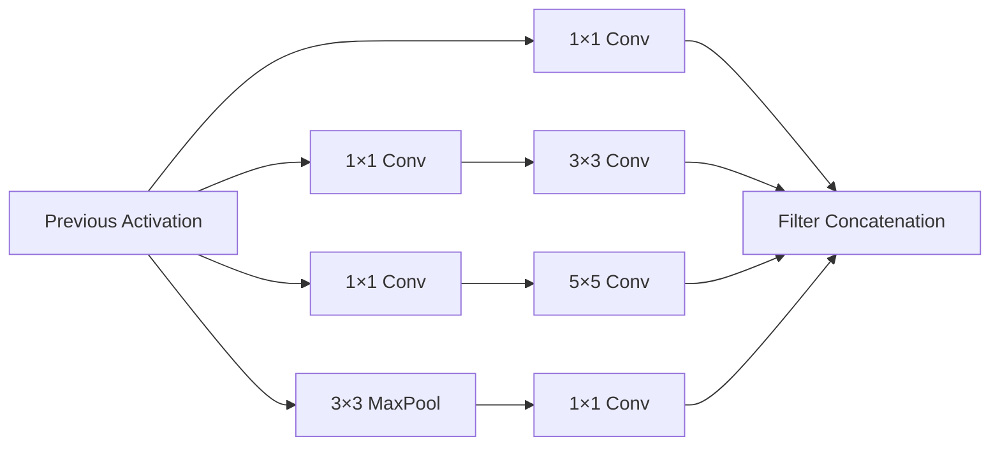

# 吴恩达深度学习

> - 类型：网课，28:35:40，192 集
> - 讲师：Andrew Ng（吴恩达）
> - 链接：https://www.bilibili.com/video/BV1Bq421A74G
> - 来源：经典网课
> - 开始日期：20260525周日

## 1 — 1.0欢迎来到深度学习！（05:32）
- [x] 0.3%，20260531周日

吴恩达介绍深度学习在今天时代的作用，吴恩达介绍了课程将会讲解的内容。一共5门课。

- 第一门课：神经网络和深度学习。4周。吴恩达实现猫咪图像识别。
- 第二门课：优化深度神经网络：超参数调优、正则化和优化算法
- 第三门课：结构化机器学习项目
- 第四门课：卷积神经网络
- 第五门课：自然语言处理：构建序列模型。吴恩达构建自然语言生成、语音识别、音乐生成。

下小节吴恩达把深度学习应用到监督学习上。

## 2 — 1.1什么是神经网络（07:17）
- [x] 0.7%，20260531周日

吴恩达拿出机器学习中的房价预测例子。吴恩达再次为这个例子搭建一个神经网络。

用线性回归预测的话，因为价格不能为负数，所以 max(0, y)，这样预测函数就变成一个叫做 ReLU的函数。

吴恩达指出线性回归就是只有一个神经元的神经网络。

吴恩达增加房价预测例子中的特征数量，构建成深层的神经网络，就是有更多神经元和层数的神经网络。

下小节吴恩达拿出更多监督学习的神经网络。

## 3 — 1.2监督学习与神经网络（08:29）
- [x] 1.2%，20260531周日

吴恩达举例监督学习的应用。

- 房价预测：输入房屋特征，预测价格。
- 广告推荐：输入广告信息和用户信息，输出用户会不会点击。
- 图像分类：输入像素，输出图像标签。
- 语音识别：输入音频，输出识别出来的文本。
- 机器翻译：输入英语，输出中文。
- 自动驾驶：输入图片、雷达数据，输出其他车的位置。

吴恩达区分监督学习的数据类型：结构化数据和非结构化数据。

- 结构化数据：房价预测、广告推荐。
- 非结构化数据：音频、图像、文本。

吴恩达表述神经网络变革了监督学习。

下小节吴恩达分析神经网络发展了几十年直到现在（2018年）才表现得这么好的原因。

## 4 — 1.3监督学习与神经网络（10:22）
- [x] 1.8%，20260601周一

吴恩达分析深度学习发展的3个维度：

- 数据：结构化的数据集；在一定范围内，如果数据集越大，神经网络效果越好。神经网络越大，效果也会越好。如果数据集比较少，构建模型就比较依赖于对特征的设计和算法的细节，SVM等算法或神经网络构建的模型可能难分伯仲。
- 计算：CPU或者GPU的发展让计算能力更强。
- 算法：研究人员一直在研究更好的算法，这些算法主要是为了让神经网络计算更快。吴恩达举例ReLU激活函数（Rectified Linear Unit），只有零点左边是平缓的，右边是陡峭的，与Sigmoid函数相比，梯度下降更快。

下小节吴恩达总结这门课的具体内容。

## 5 — 1.4关于这门课（02:28）==quiz==
- [x] 2.0%，20260601周一

吴恩达拿出这门课的安排表：

- 第一周：第一周介绍一些基础的深度学习的概念，比如：神经网络的各种应用场景，神经网络的输入和输出，促进神经网络发展的因素。
- 第二周：实现神经网络需要的一些原理，包括一些基本的前向传播、反向传播的算法。
- 第三周：实现一个单隐藏层的神经网络，写代码实现。
- 第四周：实现一个深层的神经网络。

本周结束有10道选择题需要做一下。(已经做了)

## 6 — 1.5课程资源（01:56）
- [x] 2.1%，20260601周一

吴恩达提醒可以在官网上提问题和回答问题。团队参与课程培训可以联系官方获得帮助。

## 7 — 1.6Geoffrey Hinton访谈（选修）（40:23）
- [x] 4.5%，20260601周一

吴恩达对话辛顿。辛顿列出自己的求学过程和研究历程。

辛顿，1966年前后，中学，同学Inman Harvey，大脑全息图。

辛顿，1966-1970，剑桥大学，主修心理学，旁听哲学。

辛顿，1972-1978，英国爱丁堡大学PHD。

辛顿，用神经网络做视觉理解的研究方向，不被认可。坚持。

辛顿，1978-1982年，加州大学圣地亚哥分校，博士后。胶囊网络。

辛顿，给学习深度学习的人的建议：别看太多论文，看到直觉告诉自己别人做得不好的地方，自己做好它。要相信自己的直觉不要放弃。要一直编程，只有在编程中才能发现让算法真正生效的小技巧。找信念相似的导师才能得到更加够价值的建议。

吴恩达曾邀请辛顿参与mooc第一门深度学习课程建设。辛顿与吴恩达互致感谢。结束。

## 8 — 2.1二元分类（08:24）
- [x] 4.9%，20260601周一

吴恩达拿出识别一张图片是不是一只猫，对图像逻辑回归的例子。

吴恩达说明了实现逻辑回归算法的符号表示：

- x ：一列就是一个输入样本。每张图片是一个 64 x 64 x 3 =12,288 的列向量。
- y ：一列就是一个输入样本。

下小节吴恩达编程实现逻辑回归。

## 9 — 2.2逻辑回归（06:00）
- [x] 5.3%，20260601周一

吴恩达讲解了逻辑回归函数：$\hat{y} = \sigma (wx+b)$ 。

吴恩达指出有的教程喜欢为 x 添加一个全为1的特征行，网络参数设置为 $\theta = (b, w_1,\cdots,w_n)$ ，吴恩达规定本门课程不会使用这种符号标记，因为讲 b, w 拆开更好实现神经网络。

下小节吴恩达定义一个代价函数，用来训练模型。

## 10 — 2.3逻辑回归损失函数（08:12）
- [x] 5.8%，20260601周一

吴恩达给出逻辑回归的损失函数和代价函数：

- 损失函数：$L(\hat{y}, y) = -(y \log \hat{y} + (1-y) \log (1-\hat{y}))$
- 代价函数：$J(w, b) = -\frac{1}{m} \sum_{i=1}^{m} [y^{(i)} \log \hat{y}^{(i)} + (1-y^{(i)}) \log (1-\hat{y}^{(i)})]$，其中 $\hat{y}^{(i)} = \sigma(wx^{(i)} + b)$

吴恩达演示逻辑回归这个小型神经网络的运作过程。

## 11 — 2.4梯度下降（11:24）
- [x] 6.4%，20260601周一

吴恩达给出更新模型参数 w, b 的公式，并规定偏导数符号直接使用导数符号即可:
$$
w := w - \alpha \frac{dJ(w,b)}{dw} \\
b := b - \alpha \frac{dJ(w,b)}{db}
$$
吴恩达在 J - w,b 图象上演示了梯度下降的含义。

下小节吴恩达介绍一点导数的知识。

## 12 — 2.5导数（07:11）

- [x] 6.9%，20260601周一

吴恩达绘制一条过零点的直线，演示导数就是直线的斜率，不管横坐标改变多少，纵坐标永远改版横坐标改变量的3倍。

下小节吴恩达演示曲线的斜率。

## 13 — 2.6更多导数示例（10:28）
- [x] 7.5%，20260601周一

吴恩达绘制了一条抛物线，演示导数在函数的不同位置，会一直变化。吴恩达给出 log 函数的导数公式。

吴恩达总结如果想要知道导数公式就翻开微积分教材或者上维基百科搜索。

下小节吴恩达演示计算图计算更加复杂的导数。

## 14 — 2.7计算图（03:34）
- [x] 7.7%，20260601周一

吴恩达演示计算图就是按照计算公式从内层到外层层层计算直到算出最终的成本的值 J 。

下小节吴恩达演示计算图如何进行反向计算。

## 15 — 2.8计算图求导数（14:35）
- [x] 8.5%，20260601周一

吴恩达拿出导数的链式法则，演示反向传播在整条链中计算各个中间变量的导数值的方法。

下小节吴恩达用计算图算逻辑回归的导数。

## 16 — 2.9逻辑回归梯度下降（06:43）
- [x] 8.9%，20260601周一

吴恩达用链式法则计算逻辑回归中每个中间参数的导数，最终使用 w, b 的导数更新值。

下小节吴恩达演示多个样本的梯度下降。 

## 17 — 2.10m示例上的梯度下降（08:01）
- [x] 9.4%，20260601周一

吴恩达演示多样本梯度下降的计算过程：

- 在一个 for 循环中，遍历 m 个样本，每次循环计算所有 dw1, dw2, db 等
- 将所有 dw, db 加到一起，最后除以 m 。

下小节吴恩达演示用向量化来取消这层 for 循环。

## 18 — 2.11向量化（08:05）
- [x] 9.9%，20260601周一

吴恩达在 jupyter notebook 上写下几行简单的代码，演示使用 np.dot() 函数计算两个1000000维度的向量点乘的时间可能是1.5毫秒，而使用 for 循环计算可能是450毫秒。直观表现了两者效率的差异。

GPU并行计算能力更强，CPU并行计算能力也很强。

下小节吴恩达演示更多向量化计算的例子。

## 19 — 2.12更多向量化示例（06:20）
- [x] 10.2%，20260601周一

> 🎉 恭喜突破 10%！🎉

吴恩达演示其他 numpy 的内置函数，强调要经可能避免写下任何for循环。

吴恩达演示使用 numpy 内置函数去掉对参数 w 的 for 循环的计算。

下小节吴恩达演示使用 numpy 去掉最外层对演本数 m 的 for 循环。

## 20 — 2.13向量化逻辑回归（07:33）
- [x] 10.7%，20260601周一

吴恩达演示通过向量化同时计算所有样本的 z 的过程，也就是前向传播。更加具体地，就是下面这行代码：

```python
z = np.dot(w.T, X) + b
```

下小节吴恩达演示向量化对所有样本进行方向传播的过程。

## 21 — 2.14向量化逻辑回归的梯度输出（09:38）
- [x] 11.2%，20260601周一

吴恩达演示用向量化对所有样本进行梯度下降计算，更加具体地，就是下面5行代码：

```python
z = np.dot(w.T, X) + b
A = 1 / (1 + np.exp(-z))     # sigmoid，即 σ(z)
dz = A - Y
dw = (1/m) * np.dot(X, dz.T) # 向量化计算梯度
db = (1/m) * np.sum(dz)      # 所有样本的 dz 求平均
```

下小节吴恩达演示 python 广播机制让代码更加简洁的技巧 。

## 22 — 2.15Python中的广播（11:07）
- [x] 11.9%，20260601周一

吴恩达演示4个 python 和 numpy 中广播的例子总结广播的一般规律：

$$
\begin{bmatrix} 1 & 2 & 3 \\ 4 & 5 & 6 \end{bmatrix} + \begin{bmatrix} 100 & 200 & 300 \end{bmatrix}
= \begin{bmatrix} 101 & 202 & 303 \\ 104 & 205 & 306 \end{bmatrix} \\\\

\begin{bmatrix} 1 & 2 & 3 \\ 4 & 5 & 6 \end{bmatrix} + \begin{bmatrix} 100 \\ 200 \end{bmatrix}
= \begin{bmatrix} 101 & 102 & 103 \\ 204 & 205 & 206 \end{bmatrix} \\\\

\begin{bmatrix} 1 & 2 & 3 \\ 4 & 5 & 6 \end{bmatrix} + 100
= \begin{bmatrix} 101 & 102 & 103 \\ 104 & 105 & 106 \end{bmatrix} \\\\

\begin{bmatrix} 100 \\ 200 \end{bmatrix} + \begin{bmatrix} 1 & 2 & 3 \end{bmatrix}
= \begin{bmatrix} 101 & 102 & 103 \\ 201 & 202 & 203 \end{bmatrix}
$$

## 23 — 2.16python numpy 向量的注释（06:50）
- [x] 12.3%，20260601周一

吴恩达提醒不要使用 numpy 中秩为1的数组，从源头消除 python 代码中的 bug ：

```python
# 不要使用这种
a = np.random.rann(5)  # a.shape = (5,)

# 要使用这种
a = np.random.randn(5, 1) # a.shape = (5, 1)
a = np.random.randn(1, 5) # a.shape = (1, 5)

# 多assert进行检查
assert(a.shape == (5, 1))

# 多reshape()进行确认
a = a.reshape((5, 1))

```

## 24 — 2.17Jupyter iPython 笔记本的快速浏览（03:44）
- [x] 12.5%，20260601周一

吴恩达演示 jupyter notebook 的使用方法。

下小节吴恩达演示逻辑回归的损失函数的计算过程。

## 25 — 2.18逻辑回归损失函数的解释（选修）（07:15）==quiz、lab==
- [x] 12.9%，20260601周一

吴恩达拿出概率论的概率公式，推导逻辑回归的代价函数合适的原因。主要是下面这几个公式：

给定 x 时 y=1 和 y=0 的概率：
$$
p(y=1|x) = \hat{y},\quad p(y=0|x) = 1 - \hat{y}
$$

合并为一个公式：
$$
p(y|x) = \hat{y}^y (1-\hat{y})^{(1-y)}
$$

独立同分布假设下，所有样本的似然函数（连乘）：
$$
L = \prod_{i=1}^{m} p(y^{(i)}|x^{(i)}) = \prod_{i=1}^{m} \hat{y}^{(i)y^{(i)}} (1-\hat{y}^{(i)})^{(1-y^{(i)})}
$$

取对数得到对数似然：
$$
\log L = \sum_{i=1}^{m} [y^{(i)} \log \hat{y}^{(i)} + (1-y^{(i)}) \log(1-\hat{y}^{(i)})]
$$

最大化对数似然等价于最小化负对数似然，除以 m 即得代价函数：
$$
J(w,b) = -\frac{1}{m} \sum_{i=1}^{m} [y^{(i)} \log \hat{y}^{(i)} + (1-y^{(i)}) \log(1-\hat{y}^{(i)})]
$$


本周结束有问答题和编程题，需要完成一下。

## 26 — 2.19Pieter Abbeel访谈（选修）（16:04）
- [x] 13.8%，20260602周二

Pieter 曾是吴恩达的学生。

Pieter 学生生涯：14岁想要成为职业篮球运动员。 喜欢数学和物理，本科喜欢工程学科，选择电气工程 。博士对任何工程学科都感兴趣，选择AI。 

Pieter 的研究工作：将强化学习应用到直升机自动飞行、自动叠衣服机器人。2012年AlexNet出来之后研究深度强化学习。

Pieter 给“深度强化学习”的学习者建议：多动手实践，可以自学。举例16岁英国少年通过自学在Kaggle比赛中名列前茅。


## 27 — 3.1神经网络概览（04:27）
- [x] 14.1%，20260602周二

吴恩达规定了神经网络的符号表示， $\mathbf{W}^{[1]}$ 表示第一层神经网络层的权重，[1] 表示第一层。

吴恩达演示了神经网络的前向传播和方向传播的计算过程。

吴恩达概括将逻辑回归重复两次就是一个神经网络。

下小节吴恩达演示神经网络的表现形式。

## 28 — 3.2神经网络的表现形式（05:15）
- [x] 14.4%，20260602周二

吴恩达绘制了一个 3输入 + 4个神经元 + 1个神经元的神经网络。然后写下 每层的输入输出为 x 或 a，以及 w, b 的形状：该层有几个神经元 w 就有对应的行数，有几个输入 w 就有对应的列数。

下小节吴恩达演示这个神经网络的计算过程。

## 29 — 3.3计算神经网络的输出（09:58）
- [x] 15.0%，20260602周二

吴恩达演示了 3神经元 + 1神经元 的神经网络的符号表示，$W^{[1]}_2$ 表示第 1 个隐藏层的第 2 个神经元的3个输入分量对应的权重。

吴恩达演示了每个神经元内部都会进行 2 步计算，先计算 z ，再计算 a ，并演示了整个神经网络的所需要进行的计算。

这个神经网络的前向传播只需要进行4步计算即可：
$$
\begin{aligned}
&z^{[1]} = W^{[1]}x + b^{[1]} \\
&a^{[1]} = \sigma(z^{[1]}) \\
&z^{[2]} = W^{[2]}a^{[1]} + b^{[2]} \\
&a^{[2]} = \sigma(z^{[2]})
\end{aligned}
$$

下小节吴恩达演示对所有训练样本的计算向量后之后，进行一次矩阵运算即可对所有训练样本同时完成前向传播。

## 30 — 3.4多样本向量化（09:06）

- [x] 15.5%，20260602周二

吴恩达把多个样本输入 x 和中间值 z, a 横向堆叠起来，实现多样本的向量化。

下小节吴恩达推导多样本向量化这么算法的合理性。

## 31 — 3.5向量化实现的解释（07:38）
- [x] 16.0%，20260602周二

吴恩达用具体的矩阵符号演示了多样本向量化计算的过程。

下小节吴恩达拿出其他激活函数。

## 32 — 3.6激活函数（10:57）
- [x] 16.6%，20260602周二

吴恩达拿出4种激活函数：

- sigmoid：$\sigma(z) = \frac{1}{1+e^{-z}}$
- tanh：$\tanh(z) = \frac{e^z - e^{-z}}{e^z + e^{-z}}$
- ReLU：$\text{ReLU}(z) = \max(0, z)$
- Leaky ReLU：$\text{Leaky ReLU}(z) = \max(\alpha z, z)$，其中 $\alpha$ 是一个很小的常数（如 0.01） 

吴恩达分享经验：

- 除了二分类任务使用Sigmoid，其他情况基本不用Sigmoid，tanh比Sigmoid效果好得多。
- ReLU基本上是最好的，如果不知道用什么就用它。Leaky ReLU听说也挺好，只是吴恩达没怎么用过。这两个激活函数比Sigmoid更好的原因都是因为导数为零的位置更少。

下小节吴恩达直观呈现激活函数的必要性。

## 33 — 3.7为什么需要非线性激活函数（05:36）

- [x] 16.9%，20260602周二

吴恩达对只使用线性激活函数的神经网络模型的公式进行推导，并得出结论：神经网络退化成单层的线性回归。

输出层可以使用线性函数，特别地，房价预测中房价非负，输出层使用ReLU函数保证输出正值。

隐藏层必须使用激活函数。

下小节吴恩达推导激活函数的导数。

## 34 — 3.8激活函数的导数（07:58）
- [x] 17.4%，20260602周二

吴恩达通过对数学公式的推导得出4种激活函数的导数的计算公式。

- sigmoid：$\sigma'(z) = \sigma(z)(1 - \sigma(z))$ 
- tanh：$\tanh'(z) = 1 - \tanh^2(z)$ 
- ReLU：$\text{ReLU}'(z) = \begin{cases} 1 & z > 0 \\ 0 & z < 0 \end{cases}$（$z=0$ 处通常定义为 0 或 1）
- Leaky ReLU：$\text{Leaky ReLU}'(z) = \begin{cases} 1 & z > 0 \\ \alpha & z < 0 \end{cases}$，其中 $\alpha$ 是一个很小的常数（如 0.01）

下小节吴恩达讲梯度下降运用到神经网络中。

## 35 — 3.9神经网络的梯度下降（09:58）
- [x] 18.0%，20260602周二

吴恩达推导并给出正向传播的公式。

吴恩达直接给出反向传播的公式，没有进行解释。

 下小节吴恩达推导正向传播和反向传播的公式。

## 36 — 3.10反向传播的直觉（选修）（15:49）
- [x] 18.9%，20260602周二，20260603周三

吴恩达对每一层的梯度下降公式进行推导。单样本的推导脉络是这样：
$$
dz^{[2]} = a^{[2]} - y \\\\

dW^{[2]} = dz^{[2]} a^{[1]T} \\\\

db^{[2]} = dz^{[2]} \\\\

dz^{[1]} = W^{[2]T} dz^{[2]} * g^{[1]\prime}(z^{[1]}) \\\\

dW^{[1]} = dz^{[1]} x^T \\\\

db^{[1]} = dz^{[1]}
$$
（不管更新第几层的权重，都是先对 z 求导，得到 dz，再对 w 、 b 求导，得到 dw、db。）

对照到多样本，推导脉络是这样：
$$
dZ^{[2]} = A^{[2]} - Y \\\\

dW^{[2]} = \frac{1}{m} dZ^{[2]} A^{[1]T} \\\\

db^{[2]} = \frac{1}{m} \text{np.sum}(dZ^{[2]}, \text{axis} = 1, \text{keepdims} = \text{True}) \\\\

dZ^{[1]} = W^{[2]T} dZ^{[2]} * g^{[1]\prime}(Z^{[1]}) \\\\

dW^{[1]} = \frac{1}{m} dZ^{[1]} X^T \\\\

db^{[1]} = \frac{1}{m} \text{np.sum}(dZ^{[1]}, \text{axis} = 1, \text{keepdims} = \text{True})
$$
吴恩达还分析了每一个矩阵变量的形状，说明每个矩阵的维度都能够在计算过程中相互对应。

吴恩达表示反向传播公式的推导是机器学习中最难的部分，理解不了公式可以不理解，只需要建立梯度下降的直觉。

下小节吴恩达初始化神经网络的权重。

## 37 — 3.11随机初始化（07:58）
- [x] 19.4%，20260603周三

吴恩达写下对参数进行初始化的代码：

```python
# 2输入 + 2神经元 + 1神经元
w1 = np.random.randn((2, 2)) * 0.01
b1 = p.zeros((2, 1))

w2 = np.random.randn((2, 2)) * 0.01
b2 = p.zeros((2, 1))
```

吴恩达分析「随机数 \* 0.01」的原因：

- 如果将所有 w 全都设置为0或其他相同的值，会导致对称性问题，所有神经元的梯度下降的方向都是一样的。 b 可以不使用随机数，是因为 w 的随机性已经消除了对称性问题。
- 乘以 0.01 可以使得梯度下降在 sigmoid 或者 tanh 等激活函数中远离平缓的两端，加快收敛速度。

下小节吴恩达在深层神经网络中，给不同层的 w 随机初始化之后乘上不同于 0.01 的值。

## 38 — 3.12Ian Goodfellow访谈（选修）（14:56）
- [x] 20.2%，20260603周三
> 🎉🎉 恭喜突破 20%！🎉🎉

Ian介绍自己的学习研究生涯，一开始学习神经科学，然后选修了吴恩达在斯坦福的人工智能入门课。逐渐对人工智能感兴趣。在一次疑似脑出血的诊断期间，重新思考让后人继续推进自己的研究的方法。

Ian 分享自己的经验：在送别朋友的酒吧聚会上，想到了 Gan 网络的思路，回家之后在凌晨将第一版代码写出来并且运行良好。

Ian认为想要获得深度学习的工作，PHD.不是最重要的，可以自学深度学习的知识，在学习过程中，将深度学习的内容应用到自己感兴趣的领域，并将项目开源到 github 上，如果有相关研究者对这些 github 上的项目感兴趣，会直接邀请合作，Ian通过这种方式招聘了一些人。

Ian表示今天机器学习有很多可以研究的方向，需要考虑的更多是研究的方向。

## 39 — 4.1深L层神经网络（05:52）
- [x] 20.6%，20260603周三

吴恩达说明深层神经网络中的符号标记法，和之前已经说明很多遍的内容一致，说明了 w, b, z, a 等变量比如 $w^{[1]}$ 上标的含义。

下小节吴恩达演示前向传播的过程。

## 40 — 4.2深层网络中的正向传播（07:16）
- [x] 21.0%，20260603周三

吴恩达写下了每一层的前向传播计算公式，通用到每一层的公式是这样：
$$
\begin{aligned}
z^{[l]} &= W^{[l]} a^{[l-1]} + b^{[l]} \\
a^{[l]} &= g^{[l]}(z^{[l]})
\end{aligned}
$$
现在的计算还存在一个 for 循环：就是对所有层的遍历。吴恩达表示这是不可避免和解决的，这层循环是只能保留的。

下小节吴恩达在纸上写下每一层矩阵的维度。

## 41 — 4.3正确的矩阵维数（11:10）
- [x] 21.7%，20260604周四

吴恩达在一张纸上写下单样本的每一层计算的矩阵维度。

吴恩达在一张纸上写下多样本的每一层计算的矩阵维度。

第 $l$ 层的 w，也就是 $w^{[l]}$ 的维度为 $(n^l, n^{l-1})$ 。 $b^{[l]}$ 的维度为 $(n^l, 1)$ ，只是多样本前向传播计算 Z 的时候 python 和 numpy 会自动对 b 进行广播，类似这样：
$$
\begin{aligned}
Z^{[1]} &= W^{[1]} \cdot X + b^{[1]} \\\\
(n^{[1]}, m) &= (n^{[1]}, n^{[0]}) \cdot (n^{[0]}, m) + \underbrace{(n^{[1]}, 1)}_{\text{b 原本维度}} \\
&\qquad\;\,\xrightarrow{\text{b 广播：列向量复制 m 次}}\; (n^{[1]}, m)
\end{aligned}
$$

下小节吴恩达分析深层神经网络比浅层神经网络更好的原因。

## 42 — 4.4为什么深度这么有理（10:34）
- [x] 22.3%，20260604周四

吴恩达通过2种直觉 分析深度有效的原因：

- 人脸识别中，深度神经网络的第一层可能提取脸部的边缘斜线，第二层可能开始提取更大视野，也就是鼻子眼睛等，第三层可能提取更加的视野，也就是整个脸部。吴恩达解释这种解释源于人们可能认为人类的视觉就是这么运作的。
- 门电路中，对多个特征做奇偶校验。
    - 使用深层网络，层数 $O(\log n)$，总神经元数 $O(n)$ ，每个隐藏层的结果通过结合律一步步传递到输出层。
    - 如果只有1个隐藏层，这个隐藏层需要 $O(2^n)$ 的神经元，才能一次性遍历所有组合的可能性，不运用任何规律，直接死记硬背每种情况该是0还是1，最后在输出层检查隐藏层有没有出现1。


下小节吴恩达演示前向传播和反向传播的过程。

## 43 — 4.5为深层神经网络构建模块（08:34）
- [x] 22.8%，20260604周四

吴恩达把每一层变成一个前向传播的构建快和一个反向传播的构建快，在这些构建块中缓存前向传播的数据供给反向传播使用。

前向传播每一层通过 w, b 计算出a，缓存 Z, w, b 的值。反向传播通过缓存的 Z, w, b 计算 da 并层层往前传递，计算 dw, db，从而更新 w, b 。

下小节吴恩达实现前向传播和反向传播的代码。

## 44 — 4.6正向和反向传播（10:30）==lab==
- [x] 23.4%，20260604周四

吴恩达定义正向传播的输入和输出。写下公式和代码。

- 输入：$a^{[l-1]}$ ，输出：$a^{[l]}$ ，缓存：$z^{[l]}$ 。

吴恩达定义反向传播的输入和输出。写下公式和代码。

- 输入：$da^{[l]}$ ，输出：$da^{[l-1]},dW^{[l]},db^{[l]}$ 。

吴恩达提醒对公式不理解可以动手完成本周的练习实验，写完代码之后就能理解了。

吴恩达表达观点：神经网络的有效性不在于代码量，代码量一般很少，而是取决于数据。

下小节吴恩达定义并调节参数和超参数。

## 45 — 4.7参数vs超参数（07:17）
- [x] 23.8%，20260604周四

吴恩达定义深度学习中的参数和超参数。

- 参数：w, b
- 超参数：学习率、迭代次数、层数、神经元数、激活函数。
- 其他超参数：动量momentum、最小批大小 minibatch size、正则化 regularization。

吴恩达说需要进行多次实验，并观察 J - iteration 曲线，决定超参数的选取。 

下一门课吴恩达使用系统性方法决定超参数的取值。

下小节吴恩达表达看法：神经网络和大脑的关系。

## 46 — 4.8这与大脑的关系是什么（03:18）
- [x] 24.0%，20260604周四

吴恩达表示神经网络和人的大脑其实没有什么关系，大脑的工作方式比公众知道的复杂得多。吴恩达已经比较少用大脑来类比神经网络。

## 47 — 1.1训练 开发 测试集（12:05）
- [x] 24.7%，20260604周四

吴恩达把样本划分为训练集、开发集、测试集。

吴恩达表示：

- 在前机器学习时代，样本普遍比较少，比如100～10000个样本。一般使用 70/30 的训练/测试数据集比例，或者 60/20/20 的训练/开发/测试数据集比例。
- 在现在的大数据时代，样本普遍比较多，可能有100万样本。可能是 98/1/1 的训练/开发/测试数据集比例，甚至验证集和测试集的比例更少。

吴恩达举例猫识别的程序。可能训练数据是从网上下载下来的高清图片，而开发/ 测试数据集是用户上传的模糊的随便拍摄的数据。其他场景下的应用也是可能数据集比较小，就使用爬虫程序爬取网络上的数据进行训练。吴恩达分享经验：确保训练/验证/测试数据集中的数据分布相同即可。吴恩达说这条经验会在后面的小节中详细描述。

下小节吴恩达通过使用偏差和方差来改进算法。

## 48 — 1.2偏见 方差（08:47）
- [x] 25.2%，20260604周四

吴恩达定义了偏差和方差。通过计算在训练集上的偏差和开发集上的方差，比较偏差和方差和基线的差距，就知道模型存在欠拟合还是过拟合。

下小节吴恩达拿出一个系统性解决偏差和方差的方法。

## 49 — 1.3机器学习的基本配方（06:22）
- [x] 25.6%，20260604周四

吴恩达拿出改进高偏差和高方差的方法：

- 高偏差：更大的网络、更长的训练时长、探索其他网络架构。
- 高方差：更多数据、正则化、探索其他网络架构。

下小节吴恩达对模型进行正则化，正则化涉及对偏差和方差的权衡。

## 50 — 1.4正则化（09:43）
- [x] 26.2%，20260605周五

吴恩达拿出逻辑回归的正则化公式，在代价函数中加入 w 的 L2 范数。

吴恩达拿出神经网络的正则化公式，在代价函数中加入 w 的 Frobenius 范数的平方（也可以叫 L2 范数的平方，即矩阵中所有元素的平方和）。

神经网络加上正则化之后， w 的权重更新公式为：$W^{[l]} := (1 - \frac{\alpha\lambda}{m}) W^{[l]} - \alpha \cdot dW$ ，所以正则化也叫 weight decay ，即权重衰退。

下小节吴恩达分析正则化缓解过拟合的原因。

## 51 — 1.5为什么正则化可以减少过拟合（07:10）
- [x] 26.6%，20260605周五

吴恩达展示两个直觉上的理解：

- 吴恩达绘制了一个深层神经网络作为示例图，正则化项使得所有权重都变得更加小，其中有部分不重要的权重变得更加小，接近零，对模型的影响微乎其微，模型退化为更加简单的函数，减少了过拟合。
- 以 tanh 激活函数为例，正则化项使得 z 减小了，更加靠近 tanh 函数中间接近线性变化的区域，使得模型更加接近线性函数，模型退化成更加简单的线性函数，减少了过拟合。

下小节吴恩达使用另一个正则化方法来优化模型，也就是 dropout。

## 52 — 1.6正规化抛弃（09:26）
- [x] 27.1%，20260605周五

吴恩达定义 dropout 就是在训练阶段，对每一个样本的每一次前向传播和反向传播中随机丢弃部分神经元，然后对 a 进行缩放。

吴恩达写下前向传播的 dropout 代码。

```python
# 演示 layer=3， keep-prob=0.8

d3 = p.random.rand(a3.shape[0], a3.shape[1]) < keep-prob
a3 = np.multiply(a3, d3)
a3 /= keep-prob  # 进行缩放，使得代价函数或 a 的减小不是因为 dropout 而减小
```

吴恩达提醒测试阶段不需要添加 dropout ，否则只会引入噪声。

下小节吴恩达分析 dropout 有效的原因。

## 53 — 1.7理解抛弃（07:05）
- [x] 27.5%，20260605周五

吴恩达拿出结论： dropout 有类似于 L2 范数正则化的效果。dropout 使得模型不能够过于依赖单一的特征，从而自动平衡不同特征的贡献，达到正则化的效果。

吴恩达演示为不同层设置不同的 keep-prob 的方式：如果一个层参数 $W^{[l]}.shape = (n^l, n^{l-1})$ 比较多，就可以 dropout 多一点。一个层的参数较少，就可以 dropout 少一点。输入层一般不用 dropout 。

吴恩达指出 dropout 的缺点是不好调试， dropout 使得代价函数 J 不再单调递减，因为每次迭代都是在训练一个不同的子网络，J 函数跳动。J 函数跳动也可能是代码有 bug，吴恩达建议先关闭 dropout 观察 J 函数是否单调递减，再开启 dropout 继续训练。

吴恩达分享经验，计算机视觉的数据总是不足，存在过拟合，所以默认会使用 dropout 。并且计算机视觉的输入很大，所以每一层的参数量很大，也适合用 dropout 。除了计算机视觉外，其他领域不一定默认用 dropout。

下小节吴恩达介绍其他正则化方法。

## 54 — 1.8其他的正则化方法（08:25）
- [x] 28.0%，20260605周五

吴恩达举例在计算机视觉中，增大数据量可能效果更好，如果成本太高，那就进行图片增强，产生更多数据。

吴恩达定义早停法：代价函数在训练集下降，并且在验证集开始上升，在这个转折点停止训练。吴恩达指出缺点：可能导致没有很好地减小代价函数。

吴恩达提到一个新概念：正交化。吴恩达把训练目标分为两个方向：

- 优化代价函数：梯度下降 等。
- 避免过拟合：正则化 等。

吴恩达指出可以使用两类工具各自优化模型，早停法造成了两类工具的混用。

后续小节吴恩达定义正交化。

下小节吴恩达使用其他方法加速训练。

## 55 — 1.9归一化输入（05:31）
- [x] 28.3%，20260606周六

吴恩达使用归一化加速代价函数收敛。

首先减，使得每个变量都移动到零点左右。公式：$$\mu = \frac{1}{m} \sum_{i=1}^{m} x^{(i)},\quad x := x - \mu$$

然后除，使得每个变量各自的方差为1。公式：$$\sigma^2 = \frac{1}{m} \sum_{i=1}^{m} (x^{(i)})^2,\quad x := x / \sigma$$

吴恩达绘制4个图像演示原理：使得代价函数的等高线图更加圆。如果代价函数呈狭长的椭圆状，从某些方向开始进行梯度下降，可能会使得代价函数振荡。

下小节吴恩达继续使用其他方法加速训练。

## 56 — 1.10梯度消失 爆炸（06:08）
- [x] 28.7%，20260606周六

 吴恩达绘制了一个深度的神经网络。

- 假设每个权重设置为 1.5 ，经过每一层的线性运算，如果输入 x 为 1 ，那么最终输出会是指数级增大 $1.5^l$ 。 
- 假设每个权重设置为 0.5 ，经过每一层的线性运算，如果输入 x 为 1 ，那么最终输出会是指数级减小 $0.5^l$ 。这时候梯度下降只能够往前走一小步，学习速度非常慢。

下小节吴恩达部分地解决梯度消失和爆炸的问题。

## 57 — 1.11深度网络权值初始化（06:13）
- [x] 29.1%，20260606周六

吴恩达对不同的激活函数，采用不同的方差来初始化权重：

- ReLU：$W^{[l]} = \text{np.random.randn(shape)} \times \sqrt{\frac{2}{n^{[l-1]}}}$
- tanh：$W^{[l]} = \text{np.random.randn(shape)} \times \sqrt{\frac{1}{n^{[l-1]}}}$ ，或者 $\sqrt{\frac{2}{n^{[l-1]} + n^{[l]}}}$ 。


吴恩达分享经验：调优过程中，选择不同的方差一般不会是高优先级的事情，一般是直接根据激活函数的类型选择一般经验下最有效的方差。

通过这种技巧，就能够部分地避免深度的神经网络训练过程中梯度消失和梯度爆炸的现象。

## 58 — 1.12梯度的数值近似（06:36）
- [x] 29.4%，20260606周六

吴恩达演示了导数的近似计算公式：

- 双边差值（更精确）：$f'(\theta) \approx \frac{f(\theta + \varepsilon) - f(\theta - \varepsilon)}{2\varepsilon}$ ，误差 $O(\varepsilon^2)$
- 单边差值：$f'(\theta) \approx \frac{f(\theta + \varepsilon) - f(\theta)}{\varepsilon}$ ，误差 $O(\varepsilon)$

双边差值比单边差值精确得多。例如 $\varepsilon = 0.01$ 时，双边误差约 0.0001，单边误差约 0.01。

通过手动计算梯度的近似值，可以验证反向传播中梯度计算公式的正确性。

下小节吴恩达使用这种手动计算方法进行梯度检查。

## 59 — 1.13梯度检查（06:35）
- [x] 29.8%，20260606周六

吴恩达把权重矩阵 w,b 全部展开拼成一个向量，然后为分别为每一个分量去一个微小的改变量 $\theta$ ，手动计算双边差值近似梯度，和反向传播计算的梯度进行比较，评估两者相差的程度，即公式：$$\text{difference} = \frac{\|d\theta_{\text{approx}} - d\theta\|_2}{\|d\theta_{\text{approx}}\|_2 + \|d\theta\|_2}$$ 。 $\|\cdot\|_2$ 为欧几里得范数（没有上标2表示平方求和之后再开方，加上上标2表示平方求和并且不用开方）。

- $\varepsilon < 10^{-7}$ ：梯度计算公式正常。
- $\varepsilon \approx 10^{-5}$ ：梯度计算可能异常，可能需要检查哪些分量相差较大。
- $\varepsilon \approx 10^{-3}$ ：梯度计算公式异常，需要检查哪些分量相差较大。

下小节吴恩达更加具体地演示梯度检查。

## 60 — 1.14梯度检查实施须知（05:19）==lab==
- [x] 30.1%，20260606周六
> 🎉🎉🎉 恭喜突破 30%！🎉🎉🎉

吴恩达列出梯度检查的5种技巧：

- 只在 debug 才开启梯度检查，训练的时候要关闭梯度检查。梯度检查成本高，训练时一直开着会浪费算力。
- 当梯度检查发现异常，检查每个部分的实现，比如是 b 的问题，还是某个 w 的问题。
- 梯度检查在计算双边差值近似梯度的时候，记得带上正则化项，否则算出来是错的。
- 梯度检验需要先关闭 dropout 或者把 keep-prob=1.0 。因为开启了随机失活之后， 每次前向传播都是一个随机的子网络，也就很难将双边差值近似梯度和反向传播梯度对齐。

吴恩达总结这周的学习内容：

- 设置训练集/验证集/测试集的方法
- 分析偏差和方差并应用各种方法进行消除。
- 使用不同的正则化方法以加速训练 ：L2 正则化、随机失活。
- 梯度检查。

本周结束有一个实验，需要完成一下。

## — — Yoshua Bengio访谈（25:49）

> 视频集合里少了这一期对 Yoshua 的访谈：https://www.bilibili.com/video/BV13HWGzcEh3/?p=60

Yoshua的深度学习研究历程。小时候喜欢看科幻小说，1985年开始读研究生，开始看深度学习的论文，然后从事深度学习相关的研究。

Yoshua是最早一批研究深度神经网络的研究者，讲述深度学习的研究历程，一开始是靠着直觉和实验，理论上的部分是后来才有的。 2000年开始做深度神经网络的时候并不理解梯度下降那么有效的原因，以及深度那么重要的原因。

Yoshua分享研究深度神经网络的过程中，探索有效和无效的方法的过程。 一开始以为激活函数必须是平滑的函数比如Sigmoid和tanh，而像ReLU那样的函数因为有导数为 0 的左半边被认为不合适，09 年的时候实验发现效果反而更好，一开始选择Sigmoid之类的函数是基于神经学的一些理论，而不是因为它更容易优化。

 Yoshua提到符号主义和联结主义。（符号主义就是一个概念存储于一个神经元，联结主义就是认为所有概念分布式存储在神经元群体中，相近的概念自然会有相近表示。）基于这个思想开始2000 word embedding的工作。

Yoshua罗列了自己认为比较重要的研究成果。 表达了对神经网络和大脑的关系：反向传播和大脑学习之间可能共享某种更加底层的信用分配原理。

Yoshua表达了对无监督学习的看法：至今人类还无法理解2岁的婴儿能够理解重力、惯性、固体液体的原因，仍然有广阔的探索空间。 

Yoshua对现在的深度学习最感兴趣的问题是：计算机如何观察世界，与世界互动并发现世界运作的规律。对这个问题的研究不需要和大厂竞争。 

吴恩达指出Yoshua喜欢做一些玩具小实验，并将这些小实验验证的基层原理迁移到更大的项目中。

Yoshua表示可以更多思考深度学习为什么有效，而不是去卷行业的基准。

Yoshua给进入这个行业的人的建议，一定要多动手实践写代码，不是满足于调用框架却不理解底层在做什么。

吴恩达指出他和其他几位作者合著的深度学习书很受欢迎。Yoshua建议如果想要看深度学习的论文，可以查看近几届的 ICLR 论文集。

Yoshua给进入深度学习的学习者的建议。不需要读个5年的 PHD. ，只要有基础的计算机和数学基础，就能够在6个月内学会深度学习的东西，需要知道概率论、代数、优化、微积分。

吴恩达和 Yoshua 互致感谢。

##  61 — 2.1小批量梯度下降（11:29）
- [x] 30.8%，20260606周六

吴恩达说明前提，深度学习基本上都是使用大数据量进行训练的，并且需要不断训练不同的模型来不断迭代。加速训练能够加速迭代过程。

吴恩达使用小批量梯度下降来加速训练。假设有 500 万个样本，1000 个样本为一小份，也就是一个 mini-batch ，一共 5000 小份，每一个 minibatch 做一次前向传播和反向传播，5000 小份全部做完就是一个 epoch，这就是小批量梯度下降算法。

吴恩达写下在小批量上进行前向传播的公式。

下小节吴恩达写下小批量反向传播的公式。

## 62 — 2.2理解小批量梯度下降（11:19）
- [x] 31.5%，20260607周日

吴恩达绘制两个图，展示批量梯度下降的代价函数会是凸函数，小批量下降的代价函数会是不断振荡的曲线。

吴恩达演示小批量下降中，选取不同批量大小对梯度下降的影响，并绘制等高线图：

- mini-batch size = m：退化成批量梯度下降。适合于 **m < 2000** 的数据量比较小的场景。
- mini-batch size = 1：每次只训练一个样本，退化成随机梯度下降，失去了向量化带来的加速。一般不选这个。
- mini-batch size 在 1 到 m 之间：默认选择 64/128/256/512 这4种大小，更大的像1024一般不会选。一般设置为2的指数倍。还需要保证一个小批量能够被装进 CPU 或者 GPU 的内存。

吴恩达从等高线图上展示差异：批量梯度下降曲线是最好看的，但是比较慢；随机梯度下降效果最差；小批量梯度下降代价函数不是凸的但是速度更快。

并且随机梯度下降和小批量梯度下降代价函数是不会收敛的，会一直在最优位置周围浮动，可以通过设置学习率缓解这种状况。

下小节吴恩达介绍其他优化算法。

## 63 — 2.3指数加权平均（05:59）
- [x] 31.8%，20260607周日

吴恩达列出伦敦一年的气温，因为他出生于伦敦。绘制了气温-日期三点图。

吴恩达写下指数加权平均的公式： $v_t = \beta v_{t-1} + (1-\beta) \theta_t$ 。并使用这个公式绘制一条拟合数据的曲线。吴恩达直接抛出结论： $\frac{1}{1-\beta}$ 表示公式计算出来的气温值是这前几天的平均气温。

- $\beta=0.9$ ，表示使用过去10天的气温代表当天的气温，拟合程度较好。
- $\beta=0.98$ ，表示使用过去50天的气温代表当天的气温，曲线更加平缓，并且向右偏移，有明显滞后。
- $\beta=0.5$ ，表示使用过去2天的气温代表当天的气温，曲线剧烈动荡，受异常值影响。

下小节吴恩达分析指数加权平均的原理。

## 64 — 2.4理解指数加权平均（09:42）
- [x] 32.4%，20260607周日

吴恩达把指数加权平均的公式展开：

$$
v_t = (1-\beta)\theta_t + (1-\beta)\beta\theta_{t-1} + (1-\beta)\beta^2\theta_{t-2} + \cdots + (1-\beta)\beta^{t-1}\theta_1
$$

公式表明 $v_t$ 是所有历史观测值的加权和，权重呈指数衰减（$\beta$ 的幂次越远越小）。

令 $\beta=0.9$ ，当算到往回第十个值时，权重衰减为 $0.1 \times 0.9^{10} \approx 0.035$ 。令 $\varepsilon = 1-\beta$ ，则 $(1-\varepsilon)^{\frac{1}{\varepsilon}} = 0.9^{10} \approx 0.35 \approx \frac{1}{e}$ ，即经过 $\frac{1}{\varepsilon}=10$ 天后，权重衰减到约 $\frac{1}{e}$。

吴恩达写下指数加权平均的伪代码：

```python
v = 0
for each day t:
    v = β * v + (1-β) * θ_t   # 一行代码，只存一个 v 值
```

吴恩达强调，这个算法只有一行代码，并且只需要存储一个值，非常省内存。

下小节吴恩达修正指数加权平均的偏差。

## 65 — 2.5指数加权平均数的偏差修正（04:12）
- [x] 32.6%，20260607周日

吴恩达指出上小节的指数加权平均公式初始化 v=0 ，会导致初始阶段预测值偏低。修正初始计算这个偏差的方法，就是在预测阶段多一步运算 $\frac{v_t}{1-\beta^t}$ 。吴恩达计算 t=2 时（$\beta=0.98$）：
$$
v_1 = 0.02\theta_1 \\\\
v_2 = 0.98 \times 0.02\theta_1 + 0.02\theta_2 = 0.0196\theta_1 + 0.02\theta_2 \\\\
\frac{v_2}{1-\beta^2} = \frac{0.0196\theta_1 + 0.02\theta_2}{1-0.9604} = \frac{0.0196\theta_1 + 0.02\theta_2}{0.0396}
$$

随着 t 的增大，分母趋向于 1 ，修正效果逐渐消失。

吴恩达分享经验，通常不会费心去修正偏差，而是等热身阶段过去。

下小节吴恩达用指数加权平均构建更好的优化算法。

## 66 — 2.6动量梯度下降（09:21）
- [x] 33.2%，20260607周日

吴恩达绘制等高线图，纯梯度下降可能存在左右振荡的问题，不会直接朝着圆心走，不得不选择一个比较小的学习率。

吴恩达写下动量梯度下降的公式：
$$
v_{dW} = \beta v_{dW} + (1-\beta) dW \\\\
v_{db} = \beta v_{db} + (1-\beta) db \\\\
W := W - \alpha v_{dW} \\\\
b := b - \alpha v_{db}
$$
吴恩达分享经验值 $\beta = 0.9$ 。

吴恩达把动量梯度下降具象为一个球在弓形图边缘滑向碗底，前面的 $\beta$ 参数就像是摩擦力，后面这项像是弓形碗本身的倾斜表面带来的加速。指数加权平均使得左右振荡的趋势相互抵消了，加速了梯度下降向着圆心移动。

吴恩达表示这个公式在一些论文中还有另一种写法： $v_{dW} = \beta v_{dW} + dW$ ，这种写法的问题在于调节了 $\beta$ 的值之后，缩放会导致学习率 $\alpha$ 的值也需要调整。吴恩达更多使用上面第一种写法，因为更加直观。

下小节吴恩达继续构建其他优化算法。

## 67 — 2.7RMSprop（07:42）
- [x] 33.6%，20260607周日

吴恩达写下RMSprop的公式：
$$
S_{dW} = \beta_2 S_{dW} + (1-\beta_2) dW^2 \\\\
S_{db} = \beta_2 S_{db} + (1-\beta_2) db^2 \\\\
W := W - \alpha \frac{dW}{\sqrt{S_{dW}} + \varepsilon} \\\\
b := b - \alpha \frac{db}{\sqrt{S_{db}} + \varepsilon}
$$
除数加上 $\varepsilon = 10^{-8}$ 防止除零。吴恩达分析RMSprop有效的原因，梯度变化比较大的参数梯度被除以一个更大的值而变小，梯度变化比较小的参数梯度被除以一个更小的值而变得更大，从而减小振荡。

RMSprop最早是辛顿在Coursera课程中提出的。

下小节吴恩达整合动量梯度下降和RMSprop。

## 68 — 2.8适应性矩估计（Adam）算法优化（07:08）
- [x] 34.0%，20260607周日

吴恩达写下将动量梯度下降和 RMSprop 算法结合起来的公式，也就是 Adam ：

$$
\begin{aligned}
V_{dW} &= \beta_1 V_{dW} + (1-\beta_1) dW \\
V_{db} &= \beta_1 V_{db} + (1-\beta_1) db \\
S_{dW} &= \beta_2 S_{dW} + (1-\beta_2) dW^2 \\
S_{db} &= \beta_2 S_{db} + (1-\beta_2) db^2
\end{aligned}
$$

偏差修正（解决初始阶段 $V,S$ 偏小的问题）：

$$
V_{dW}^{\text{corrected}} = \frac{V_{dW}}{1-\beta_1^t}, \quad V_{db}^{\text{corrected}} = \frac{V_{db}}{1-\beta_1^t}
$$

$$
S_{dW}^{\text{corrected}} = \frac{S_{dW}}{1-\beta_2^t}, \quad S_{db}^{\text{corrected}} = \frac{S_{db}}{1-\beta_2^t}
$$

参数更新：

$$
W := W - \alpha \frac{V_{dW}^{\text{corrected}}}{\sqrt{S_{dW}^{\text{corrected}}} + \varepsilon}
$$

$$
b := b - \alpha \frac{V_{db}^{\text{corrected}}}{\sqrt{S_{db}^{\text{corrected}}} + \varepsilon}
$$

Adam 的全称是 Adaptive Moment Estimation（适应性矩估计）。$\beta_1$ 控制一阶矩（动量），$\beta_2$ 控制二阶矩（RMSprop）。学习率 $\alpha$ 需要调整，其他超参 $\beta_1 = 0.9$，$\beta_2 = 0.999$，$\varepsilon = 10^{-8}$，通常默认值最好用。

下小节吴恩达进行学习率衰减。

## 69 — 2.9学习速率衰减（06:45）
- [x] 34.4%，20260607周日

吴恩达绘制等高线图，演示学习率需要衰减的直观现象。

吴恩达写下学习率衰减的公式：
$$
\alpha = \frac{1}{1 + \text{decay-rate} \times \text{epoch-num}} \cdot \alpha_0
$$
吴恩达写下其他几种学习率衰减公式：
$$
\alpha = 0.95^{\text{epoch-num}} \cdot \alpha_0 \\\\
\alpha = \frac{k}{\sqrt{\text{epoch-num}}} \cdot \alpha_0 \\\\
\alpha = \frac{k}{\sqrt{t}} \cdot \alpha_0
$$
还有每隔几个 epoch 减半的离散阶梯衰减和手动衰减。
吴恩达分享经验，学习率衰减是超参数调优中优先级较低的事情，一般只需要调整一个合适的学习率然后固定下来就行。

下周吴恩达系统地选择超参数。

下小节吴恩达分析局部最优解和鞍点来加深对算法调优的直觉。

## 70 — 2.10局部最优解问题（05:24）==quiz、lab==
- [x] 34.7%，20260607周日

吴恩达区分局部最优解和鞍点是不同的现象。

鞍点狭长的平台区域的导数接近 0 ，在平台区域的学习过程很缓慢。这平台区域，Adam 等优化算法能够真正起作用加速代价函数收敛。

吴恩达表示没有人能真正对这些高维空间建立真正的直觉。

半周结束有测试题和练习实验，需要完成。

## — — 林元庆访谈（13:37）

> 视频集合里少了这一期对 林元庆 的访谈：https://www.bilibili.com/video/BV13HWGzcEh3/?p=71

林元庆读博前的专业是更加偏向物理学的光学。在宾夕法尼亚大学读机器学习的博士。获得第一节ImageNet的冠军。AlexNet出来之后大受震撼。林元庆现在掌管百度的 AI 实验室。

国家聘请林元庆搭建国家人工智能平台，像是 Paddle 平台。研究人员可以把自己论文的实验在平台上完成，方便其他研究者复现实验。

林元庆建议人工智能初学者从开源平台比如 Pytorch 动手实践从而学习人工智能的技术。只是他自己是从PCA等理论知识学习之后才开始学习人工智能的，当时没有这么多开源项目，不过也是一种好的路径。

吴恩达和林元庆互致感谢。

## 71 — 3.1参数调整过程（07:11）
- [x] 35.2%，20260607周日

吴恩达列出了不同超参数的优先级：

- 最重要： $\alpha$

- 次重要： $\beta$ ，神经元个数
- 不重要：学习率衰减，小批量的大小，神经网络层数
- 不需要调：Adam 的 $\beta_1=0.9,\beta_2=0.999,\varepsilon=10^{-8}$

调优的方法：

- 使用参数空间中的离散随机点进行尝试，不要使用网格点进行遍历，因为不知道哪个超参数对问题更加重要。
- 在找到较为合适的超参数之后，缩小随机取点的范围进行第二轮微调。

下小节吴恩达确定随机取点的参数大小尺度。

## 72 — 3.2使用适当的标准来选择超参数（08:51）
- [x] 35.7%，20260607周日

吴恩达调节网络层数 $l$ 、学习率 $\alpha$ 和动量 $\beta$ 。

**网络层数 $l$** 在 50 ~ 100 之间调优，吴恩达直接均匀随机取样。

**学习率 $\alpha$** 在 0.0001 ~ 1 之间调优，吴恩达在对数尺度上均匀随机取样：
$$
r = -4*random.rand() \\\\
\alpha = 10^r
$$

对数尺度上均匀随机取样，可以让接近 0.0001 的小数值和接近 1 的大数值，两种不同尺度的数值周围都能够获得平等的采样机会。

动量 $\beta$ 在 0.9 ～ 0.999 之间调优，吴恩达进行了转换：
$$
1-\beta = 0.1 \to 0.001\\\\
r \in [-3, -1] \\\\
1-\beta = 10^r \\\\
\beta = 1 - 10^r
$$
吴恩达分析， $\beta$ 越靠近 1 ，得到的结果对 $\beta$ 的变化更加敏感。比如 0.9 和 0.9005都是对 10 天左右的气温取平均，而 0.999 和 0.9995 分别是对 1000 天 和 2000 天的气温取平均，后者相差巨大。

下小节吴恩达分享更多超参数搜索的经验技巧。

## 73 — 3.3实践中的超参数调整 熊猫vs鱼子酱（06:52）
- [x] 36.1%，20260607周日

吴恩达提醒需要根据不同的场景选择不同的调参策略。不同的领域的调参策略也许能迁移也许不能迁移到另一个领域。在一同一个应用上的最优调参策略也可能随着新数据分布的变化或者硬件的改变而不再最优。

- 广告系统等大数据的场景可以采用熊猫策略，每次只训练一个模型，在模型训练过程中不断调整超参数。
- 如果数据量比较小，可以使用鱼子酱策略，同时训练多个模型，挑一个最好的。

下小节吴恩达用一个更具有鲁棒性的策略来调参。

## 74 — 3.4网络中的正常化激活（08:56）
- [x] 36.6%，20260607周日

吴恩达抛出批归一化的结论：能够让超参数搜索问题更加简单，使神经网络对超参数的选择更加具有鲁棒性。

吴恩达在单个隐藏层上演示**批归一化 BatchNorm** 的计算公式。

和输入层的归一化不同，吴恩达不希望隐藏层中 $z^{(i)}$ 永远是均值为 0 方差为 1 的正态分布，所以引入 $\gamma 和 \beta$ 使得 z 的分布更加宽泛，更好地利用激活函数的非线性区域。

计算公式： 

$$
\begin{aligned}
\mu &= \frac{1}{m} \sum_{i=1}^{m} z^{(i)} \\[4pt]
\sigma^2 &= \frac{1}{m} \sum_{i=1}^{m} (z^{(i)} - \mu)^2 \\[4pt]
z^{(i)}_{\text{norm}} &= \frac{z^{(i)} - \mu}{\sqrt{\sigma^2 + \varepsilon}} \\[4pt]
\tilde{z}^{(i)} &= \gamma \, z^{(i)}_{\text{norm}} + \beta
\end{aligned}
$$
（$\varepsilon$ 防止除零，$\gamma$ 和 $\beta$ 是可学习的参数，随梯度下降一起更新。）

下小节吴恩达在整个神经网络中进行批归一化。

## 75 — 3.5将Batch Norm拟合到神经网络中（12:56）

- [x] 37.4%，20260608周一

吴恩达画了一个 3 输入 + 2 神经元 + 2 神经元 + 1 输出的神经网络，演示 BatchNorm 在整个神经网络中的计算链。

对隐藏层做了 BatchNorm ， 参数 b 可以去掉，因为对所有的 z 加上一个常数 b ，不会改变归一化的 $z_{norm}$ 。

吴恩达验证了单样本下的各变量的维度是一致的 $(n^{[l]},1)$ 。

下小节吴恩达剖析 BatchNorm 的原理，建立对于 Batch Norm 有效的直觉。

## 76 — 3.6为什么Batch Norm有效（11:40）
- [x] 38.0%，20260608周一，47min

吴恩达画了一个神经网络的图，分析出 BatchNorm 使得靠后的隐藏层不太收到之前的隐藏层的权重更新的影响，因为它对隐藏层做了归一化，使得每个隐藏层获得一种单独训练的效果。

吴恩达举例猫图像识别的例子，训练数据可能全部是黑色的猫，而测试数据可能全部是带颜色的猫，那么训练出来的模型可能在测试集上表现不好。吴恩达定义这种情况叫做协变量偏移。BatchNorm 的归一化使得模型自动适应这种偏移。

由于 miniBatch 每次训练的数据集只是一个子集，所以每一次 BatchNorm 归一化得到的均值和方差是存在噪声的，这使得 BatchNorm 自带类似 dropout 的轻微正则化的效果，如果miniBatch的大小选择比较大，那么这种噪声就会减弱，正则化的效果也会相应地减弱。吴恩达提醒不要因此把 BatchNorm 作为正则化的手段，只把它用作对隐藏层归一化的手段。

下小节吴恩达用 BatchNorm 训练得到的模型进行预测。

## 77 — 3.7测试时的Batch Norm（05:47）
- [x] 38.4%，20260608周一，22min

吴恩达指出测试时可能是一个样本一个样本进行测试的，无法做 BatchNorm 。

吴恩达通过在训练过程中对 $\mu$ 和 $\sigma^2$ 指数加权平均得到测试时归一化的 $\mu$ 和 $\sigma^2$ 。

吴恩达分享经验，测试时的 BatchNorm 的归一化参数的确定具有很好的鲁棒性，如果使用深度学习框架的话，一般会有默认值，效果也挺好。

下小节吴恩达发表对深度学习框架的看法。

## 78 — 3.8Softmax回归（11:48）
- [x] 39.1%，20260608周一

吴恩达拿出猫、狗、小鸡、啥也不是这四种类别的图像分类的例子。

吴恩达写下 softmax 激活函数的表达式，需要引入中间变量 t ：
$$
\begin{aligned}
z^{[L]} &= W^{[L]} a^{[L-1]} + b^{[L]} \\[4pt]
t &= e^{z^{[L]}} \\[4pt]
a_i^{[L]} &= \frac{t_i}{\sum_{j=1}^{C} t_j} = \frac{e^{z_i^{[L]}}}{\sum_{j=1}^{C} e^{z_j^{[L]}}}
\end{aligned}
$$
吴恩达具体演算 softmax 激活函数的计算过程。输出层的所有神经元的概率和为1。

吴恩达绘制了多个 softmax 激活函数的分类模型的分类效果图，可以产生多条决策边界对多个类别进行划分。

下小节吴恩达训练一个带 softmax 层的神经网络。

## 79 — 3.9训练一个softmax分类器（10:08）
- [x] 39.7%，20260608周一

吴恩达区分 hardmax 和 softmax 的区别在于 hardmax 每个向量只有一个分量为 1 ，其余分量全部为 0 。

吴恩达直接写下 softmax 分类器的损失函数和梯度计算公式，没有进行逐步推导。确认每个变量的维度一致。演示 y 的值和 $\hat y$ 矩阵。

softmax 是 逻辑回归的推广，可以用来进行多分类。

下小节吴恩达使用深度学习框架实现 softmax 分类器。

## 80 — 3.10深度学习框架（04:16）
- [x] 39.9%，20260608周一

吴恩达罗列了一些深度学习框架，分享了选择开源框架的原则，强调其中容易被忽略的一点是一个框架一定要有能够长期开源的信用，有的框架可能一开始是开源的，可是之后可能会把之前开源的内容关闭。

## 81 — 3.11TensorFlow（15:02）==lab==
- [x] 40.8%，20260608周一
> 🎉🎉🎉🎉 恭喜突破 40%！🎉🎉🎉🎉

吴恩达演示了 tensorflow 实现 $J = w^2-10w+25$ 前向传播和梯度下降的代码，包括直接优化代价函数的代码，和使用编造的训练数据进行梯度下降的代码。

本周结束有一个练习实验，需要运行一下。

## 82 — 1.1为什么选择ML策略（02:43）
- [x] 40.9%，20260608周一

吴恩达介绍这门课程的安排：构建机器学习系统，并应用各种机器学习的诊断和优化策略，找到最有希望尝试的方向。

## 83 — 1.2正交化（10:39）
- [x] 41.6%，20260608周一

吴恩达拿出老式电视机多个旋钮中每个旋钮只调节画面的一个因素的例子，指出现象：机器学习模型可以优化的方向很多，需要使用正交化的优化思路，才能对症下药，并减低操作难度。

吴恩达罗列了模型可能诊断出的4种不同的正交化问题：

- 模型在训练集上拟合得好：如果不好，可以使用更大的网络、换其他优化算法等。 
- 模型在验证集上拟合得好：如果不好，可以加入正则化项，或者收集更大的训练集。

- 模型在测试集上拟合得好：如果不好，可以使用更大的验证集。
- 模型在生产环境拟合得好：如果不好，可以修改验证集或者代价函数。

之后小节吴恩达会为不同模型诊断出不同的问题，并应用相应的正交化的方法优化模型。

## 84 — 1.3单数评价指标（07:17）
- [x] 42.0%，20260608周一

为模型确定“验证集 + 单一数字评估指标”这种方式能够比较好地评估模型性能。

吴恩达拿出猫分类的例子。

- 吴恩达举例第一种评估场景，定义模型精确率 P 和召回率 R，以及综合这两个指标的 F1 分数，公式是 $F1 score=\frac{1}{\frac{1}{P}+\frac{1}{R}}$ ，这个值也叫 P 和 R 的调和平均数。

- 吴恩达举例第二种评估场景，不同模型在不同地区的表现情况不同，也许可以取不同模型各自在不同地区的平均性能作为该模型的综合性能。

下小节吴恩达为不同指标设置基准并对模型进行优化。

## 85 — 1.4满足和优化指标（05:59）
- [x] 42.3%，20260608周一

吴恩达举例有多个不同评估指标的例子，并使用评估矩阵来综合评估不同模型。评估矩阵就是在所有指标中挑出一个优化指标，并把其他指标作为满意指标。优化指标是需要被优化的指标，满意指标是只要达到设定阈值即可。

吴恩达举例猫分类器的例子，有正确率和运行时间两个指标，两种方式综合评估：

- 单一数字评估指标：accuracy + 0.5 x running time。
- 评估矩阵：优化指标是正确率，满意指标是运行时间 < 100 ms。

吴恩达举例语音助手响应的例子比如“ hey, siri ”：优化指标是正确率，满意指标是” 24 小时内只能有一次误响应“。

下小节吴恩达为数据集划分训练、开发、测试集。

## 86 — 1.5训练 开发 测试分布（06:36）
- [x] 42.7%，20260608周一

吴恩达提出经验，构建一个好的训练集和测试集，并确定评估矩阵，能够加快机器学习系统构建的迭代过程。

吴恩达举2个例子：

- 猫分类器：可能验证集来自欧美地区，测试集可能来自亚洲澳洲，这可能会导致模型测试效果不好。
- 贷款申请：这是一个真实的工作经历，团队花了 3 个月基于中等收入地区的用户数据训练好的模型，突然被要求在低收入地区进行测试，测试效果自然不理想。

吴恩达总结经验：确保验证集和测试集保持一致的分布，并确定评估矩阵。

后续小节吴恩达构建训练集。下小节吴恩达为验证集和测试集选择合适的大小。

## 87 — 1.6开发和测试集的大小和指标（05:40）
- [x] 43.0%，20260608周一

吴恩达讲述在早期的机器学习时代，数据集可能只有 100 ～ 10000 。一般设置数据集为 Train : Test = 7 : 3 ，或者 Train : Dev : Test = 6 : 2 : 2。

在深度学习时代数据量很大的情况，数据集可能有一百万，吴恩达认为可以设置数据集为 Train : Dev : Test = 98 : 1 : 1 。甚至如果开发集够大以至于不太可能出现过拟合，也可以不设置测试集，只是吴恩达不太推荐。

设置开发集和测试集的大小取决于设置这两个集合的目的：

- 开发集用来在训练过程中评估模型那个模型更好。
- 测试集用来最终评估模型的性能。

下小节吴恩达在迭代过程的某个时机更改评估矩阵或者训练集和测试集。

## 88 — 1.7何时更改开发  测试集和指标（11:08）
- [x] 43.7%，20260608周一

吴恩达举例猫分类器的例子。有两个模型：

- 模型 1：3%错误率；
- 模型 2：5%错误率

验证发现模型 1 虽然错误率更低，但是将一些色情图也分类为猫，可能以为是橘猫什么的。相比之下模型 2 虽然错误率更高一点，但是没有将色情图分类为猫的情况。这样还是得选择模型 2 更合理。这种情况就需要修改评估举证，修改错误率的计算公式，为色情图的分类错误设置更高的权重。公式是这样：
$$
Error = \frac{1}{\sum w^{(i)}} \sum_{i=1}^{m_{dev}} w^{(i)} \cdot \mathbb{1}\{\hat{y}^{(i)} \neq y^{(i)}\}
$$

其中 $w^{(i)} = \begin{cases} 1 & \text{正常图片} \\ 10 & \text{色情图片} \end{cases}$（或更大），使得色情图的分类错误对整体误差贡献更大。

吴恩达举了第二个例子，就是训练用的网络图片都是高清的，用户的图片可能比较模型或者猫有一些奇怪的状态，可能导致模型在生产环境表现不好。

吴恩达分享经验，在评估矩阵表现良好的模型在应用中表现不好的时候，就需要修改评估矩阵或者训练集或测试集。

吴恩达分享经验，即使没有合适的评估矩阵，也要先大致设置一个暂时比较合理的，然后再根据训练情况调整评估矩阵或者代价函数，不要在没有验证集或测试集的情况下就开始训练模型，那样会降低团队的迭代效率。

## 89 — 1.8为什么选择人类水平表现（05:47）
- [x] 44.0%，20260608周一

吴恩达解释了选择人类表现水平作为基准的原因，这也是在人类擅长的任务上，模型能够在达到人类水平之前性能快速提升的原因。

- 可以通过雇佣人类获取更多标签数据；
- 可以请人分析人类能够识别其中一些图片的原因；
- 通过人类水平基准能够更好地分析偏差和方差。

模型性能在超过人类之后，提升速度会变慢。因为有些数据（如极其模糊的图片、噪点太多的音频）本身就决定了分类不可能做到 100% 正确，这个理论上无法继续降低的最低错误率叫做贝叶斯错误（Bayes error）。

下小节吴恩达通过人类在特定任务上的水平来决定减少多少偏差或方差。

## 90 — 1.9可避免的偏见（07:00）
- [x] 44.4%，20260608周一

吴恩达举例猫分类器的计算机视觉任务，人类擅长视觉任务，吴恩达直接把人类完成任务存在的误差作为贝叶斯误差。通过确定贝叶斯误差，吴恩达分辨模型更应该减小可避免的偏差，还是减小方差。

下小节吴恩达分析人类水平表现的含义。

## 91 — 1.10理解人类水平表现（11:13）
- [x] 45.1%，20260608周一

吴恩达拿出医学造影诊断的例子，罗列对人类水平表现的不同定义：普通人的水平表现、专家的水平表现、专家团队的水平表现。如果是发表学术论文或者部署具体应用，可能把普通人的水平表现定义为人类水平表现，如果是想要逼近贝叶斯误差，可能把专家团队的水平表现定义为人类水平表现。

吴恩达在偏差和人类水平表现相差较大，或者方差和偏差相差较大时，专注于不同的方向，也就是优先减小偏差或者减小方差。当偏差和方差和人类水平表现都比较接近时，就需要权衡出相差更大的那一方，此时机器学习进展也会变得更加困难。

下小节吴恩达在某些场景下让深度学习模型超过人类水平表现。

## 92 — 1.11超越人类水平表现（06:22）
- [x] 45.5%，20260608周一

吴恩达举一个极端的例子，医疗造影诊断中如果模型已经超过人类最好的水平表现，这个时候判断贝叶斯误差就只能靠直觉来决定。

结构化数据

吴恩达举4个不是人类知觉的例子，这些任务深度学习模型能够做得比人类更好，如下：

- 广告点击预测
- 产品推荐
- 预测两地的通勤时间
- 贷款申请

吴恩达举3个人类知觉的例子：

- 语音识别
- 图像识别
- 医疗诊断

吴恩达描述现状，大数据已经让深度学习模型在某些单个的监督学习任务超过人类水平，只是在人类擅长的知觉任务中，深度学习模型要想达到贝叶斯误差相对更难。

## 93 — 1.12提高您的模型性能（04:37）
- [x] 45.7%，20260608周一

吴恩达

减小偏差：3种

- 训练更大的模型。
- 训练更长时间或者选择更好的优化算法，比如：动量、RMSprop、Adam 。
- 选择其他网络架构比如 RNN 或 CNN ，或者搜索更加合适的超参数。

减小方差：3种

- 获取更多数据。
- 使用正则化：L2 正则化、dropout、数据增强。
- 选择其他网络架构比如 RNN 或 CNN ，或者搜索更加合适的超参数。

吴恩达表示这些工具易于学习并且需要大量的实践来掌握，通过使用这些工具，已经比许多机器学习的团队都要强了。

## 94 — 1.13Andrej Karpathy访谈（15:11）
- [x] 46.6%，20260608周一

卡帕西进入深度学习领域的路径。本科在多伦多大学读计算机科学和认知科学，在英属哥伦比亚大学攻读硕士，期间对人工智能很感兴趣但是对选修的人工智能课的很多决策树、深度优先、广度优先的内容不满意，直到接触到神经网络，通过优化目标函数自动发现算法，无需人工显式编程，才明确这是自己想要从事的 AI 研究方向。

卡帕西提到给 ImageNet 测定人类基线的过程。

卡帕西提到不应该把不同的任务用不同的模型进行实现，应该构建完全动态的神经网络，问题在于如何确定目标并进行优化。

卡帕西讲授斯坦福的卷积神经网络课程（CS231n），带学生读最前沿的论文。

卡帕西给入门深度学习的人的建议。在学习深度学习的时候一定需要动手实现一些底层的代码，这样才能加深理解，也才能 debug 。

卡帕西对无监督学习的看法，仍然处于原始阶段。

卡帕西对 AGI 的看法，卡帕西表示有一些思考，只是没有在访谈中透露。

## 95 — 2.1进行误差分析（10:33）
- [x] 47.2%，20260609周二

吴恩达拿出猫分类器的例子。假设模型在开发集上存在10%的误分类。吴恩达演示分析模型问题的过程。

吴恩达绘制一个表格，第一列是所有的误分类样本，第一行是所有误分类的原因，最后一列是备注。

吴恩达统计误分类图片中狗、大型猫科动物、模糊、Instagram滤镜等的样本数，并且有些在备注栏写下比特犬、雨天动物园等备注。统计不同错误类别，既可以知道应该优先解决的误分类方向。

下小节吴恩达解决样本中标记错误的数据。

## 96 — 2.2清理错误标注的数据（13:06）
- [x] 48.0%，20260609周二，49min

吴恩达分析了需要修正验证集/测试集中的错误标签数据的情况。

- 如果误分类原因为错误标签的样本占比大，就需要修正一下。吴恩达表示需要同时修正验证集和测试集，确保验证集和测试集同分布。如果占比比较小，就优先解决其他误分类原因。
- 误差分析不止需要考虑误分类的样本，有时候也需要对正确的样本进行误差分析，因为正确分类的样本中可能也存在错误标签只是恰巧分类器分对了。
- 模型对训练样本中的随机错误的鲁棒性比较高，一般训练集中的错误标签不需要去修正。如果是系统性错误，比如总是讲白狗打错标签成猫，那么就需要修正训练样本了。

下小节吴恩达搭建第一个机器学习项目，并使用错误分析进行快速迭代。

## 97 — 2.3快速构建您的第一个系统，并进行迭代（05:26）
- [x] 48.3%，20260609周二，9min

吴恩达建议在搭建一个新项目的时候，不要过度思考，先搭建一个简单和粗糙的系统，然后使用误差-偏差和误差分析，快速迭代系统。

吴恩达指出如果是已经有成熟的领域比如说人脸识别等场景已经有大量的论文，那么可以先使用已有的成熟方案。

## 98 — 2.4训练和测试的不同分布（10:56）
- [x] 48.9%，20260609周二，22min

吴恩达举2个例子。

- 猫分类器的例子。如果网络下载下来 200K 高清图片，用户上传 10K 真实图片。
- 内后视镜语音识别的例子。从数据提供商购买一些语音识别数据、智能语音控制的数据、语音激活键盘的数据，一共 500K 。语音激活后视镜的真实数据 20K 。

类似这样的数据，吴恩达不建议将非真实数据和真实数据混在一起之后进行统一划分，因为这样训练出来的模型在生产中可能性能不好。

吴恩达建议类似这样去操作，把非真实数据全部加入训练集，然后从真实数据中 50% 加入训练集，剩下的 Dev : Test = 25% : 25% 。

下小节吴恩达选择不去使用所有的数据。

## 99 — 2.5不匹配数据分布的偏差和方差（18:17）
- [x] 50.0%，20260609周二，52min
> 🎉🎉🎉🎉🎉 恭喜突破 50%！🎉🎉🎉🎉🎉

吴恩达计算5个数值，并且用这5个数值对模型进行错误诊断：

- Bayes error or Human level：人类表现水平。
- Training set error：通过比较贝叶斯误差和训练集误差，确定可避免的偏差问题
- Training-dev error：如果训练集和验证集的分布不同，可以从训练集中划分出训练验证集，通过比较训练验证集误差和训练集误差，确定方差问题。
- Dev error：通过比较训练验证集误差和验证集误差，确定数据不匹配问题。
- Test error：通过比较验证集误差和测试集误差，确定验证集过拟合的程度。

吴恩达绘制一个表格，作为一个更通用的框架，用语音激活后视镜的例子说明。表格如下：

|                                                              |       General speech recognition<br>(通用语音识别数据)       |       Rearview mirror speech data<br>(后视镜语音数据)        |
| :----------------------------------------------------------- | :----------------------------------------------------------: | :----------------------------------------------------------: |
| **Human level**<br>(人类水平)                                | <mark style="background-color: #FFCCCC;">4%<br>("Human level")</mark> |                              6%                              |
| **Error on examples trained on**<br>(训练集上的错误率)       | <mark style="background-color: #FFCCCC;">7%<br>("Training error")</mark> |                              6%                              |
| **Error on examples <u>not</u> trained on**<br>(非训练样本上的错误率) | <mark style="background-color: #FFCCCC;">10%<br>("Training-dev error")</mark> | <mark style="background-color: #FFCCCC;">6%<br>("Dev/Test error")</mark> |

吴恩达分享经验，使用红色标出的数字进行错误诊断。

下小节吴恩达解决数据不匹配问题。

## 100 — 2.6解决数据不匹配问题（10:09）
- [x] 50.6%，20260609周二

吴恩达举例，如果有 10K 小时的正常语音数据和 1 小时的车内噪音语音数据，可以把 10K 的正常语音加上这 1 小时的车内噪声形成 10K 小时的车内环境语音加入训练集。吴恩达指出车内噪声有很多种，这样做可能造成模型对这单种类型的车内噪声的语音过拟合。吴恩达分享经验，有的已经很好的语音识别系统通过这种方式能够变得更好。

吴恩达举第二个车辆识别的例子，如果只使用人工合成的车辆图片，比如游戏中的看起来非常逼真的车辆图片，可能使模型对人工合成的可能仅有的 20 种外观的汽车过拟合。

吴恩达总结数据不匹配的问题可以尝试使用人工数据合成的方式进行解决，只是需要记住人工合成的数据可能仅是真实数据的一个小子集，真实数据可能类型更加多样。

下小节吴恩达让神经网络同时从多种数据类型中学习。

## 101 — 2.7迁移学习（11:18）
- [x] 51.3%，20260609周二

吴恩达举2个例子。

- 图像识别：将普通图像识别的模型迁移到医疗放射图片的疾病诊断系统。
- 语音识别：将普通语音识别的模型迁移到语音激活系统。

吴恩达演示迁移的方法：

- 重新初始化输出层，固定隐藏层，然后在医疗放射图片数据集上对输出层进行重新训练。
- 在输出层前面添加几个隐藏层，并重新初始化输出层，然后在这些层上进行重新训练。
- 固定一部分浅层，重新训练靠后面的层。

吴恩达前调一点，迁移学习生效的几个关键点：

- 任务 A 和任务 B 具有相同的输入；
- 任务 A 的数据量远大于数据 B ，因为要迁移到任务 B ，任务 B 数据的重要性大于任务 A ，如果任务 A 本身数据量比较少，那么能够迁移过来的价值就会比较小，一般对模型性能不会有损害，只是也很难有额外收益。
- 任务 A 的浅层特征对 任务 B 有用。

下小节吴恩达让模型同时进行多任务学习。

## 102 — 2.8多任务学习（13:00）
- [x] 52.0%，20260609周二

吴恩达举例自动驾驶任务：需要识别行人、车辆、停止标志、红绿灯这 4 类标签。这就是一个多任务学习的场景。

吴恩达写下自动驾驶例子的成本函数和损失函数，y 的维度是 (4, m) ，公式如下：

每个任务的损失函数（二元交叉熵）：
$$
L(ŷ_j^{(i)}, y_j^{(i)}) = -y_j^{(i)} \log ŷ_j^{(i)} - (1-y_j^{(i)}) \log(1-ŷ_j^{(i)})
$$

总的代价函数（对 $m$ 个样本、4 个任务求和）：
$$
J = \frac{1}{m} \sum_{i=1}^{m} \sum_{j=1}^{4} L(ŷ_j^{(i)}, y_j^{(i)})
$$
吴恩达补充一点，就是数据集中可能有些图片中出现了其中3种类别，只是标签 y 只对这 3 种类别中的 2 种打了标签：`(1, 0, 1, ?)` ，这种数据可以在训练时只对 标签为 0/1 的分量进行训练，对 `?` 的分量不计入代价函数。

吴恩达总结适合多任务学习的场景：

- 每个任务的浅层特征可以共享。
- 每个任务的数据量比较少。

吴恩达分享经验，目标检测是多任务学习最成功的例子。

下小节吴恩达定义端到端学习。

## 103 — 2.9什么是端到端深度学习（11:48）
- [x] 52.7%，20260609周二

吴恩达举语音识别作为引例来定义端到端学习。多阶段的语音识别阶段包括：提取语音的特征，提取语音特征中的音素，将音素拼接成单词，再将单词拼接成句子。

当语音数据量比较少比如只有 3000 小时的时候，可能分阶段的系统性能更好，并且训练时间更短。当数据量很大比如 1万 到 10 万小时的时候，可能端到端的神经网络效果更好。

- 公司入口闸机的人脸识别的例子。分为2阶段，先检测人脸位置并将人脸区域放大，再将人脸图片和数据库中的所有公司雇员的人脸图片进行比较，从而识别出人名。这两个阶段的数据也更好获取，比端到端的训练数据要更好获取。

- 英法翻译的例子。先对英语文本进行文本分析等多个步骤，然后再对英语文本进行翻译。这种多阶段的翻译效果可能要比直接对英语文本进行翻译的效果更好。

- 通过 X光片检测儿童的年龄。先检测 X光片中的手指骨骼，然后再通过手指骨骼数据进行年龄分析，这两个阶段的数据可能都不需要很多就能让模型拥有很高的性能。如果要使用端到端的方式，可能需要更多的数据。

下小节吴恩达分享经验，适合端到端学习的场景。

## 104 — 2.10是否使用端到端深度学习（10:20）
- [x] 53.3%，20260609周二

吴恩达分析端到端深度学习的优缺点：

- 优点：可以直接让数据自己说话，可以减少手动设计组件。
- 缺点：需要更多的数据，无法用上手动设计的可能会有用的组件。

吴恩达总结想要选择端到端学习需要拥有足够多的数据，并且能够满足端到端学习所对应的 (x, y) 格式的数据。

吴恩达拿出两个例子演示选择使用端到端还是多阶段深度学习的方法。

- 语音识别：端到端的深度学习效果更好。让机器学习音素可能不是一个很好的策略。

- 自动驾驶：多阶段的深度学习效果更好。使用不同类型的设备比如雷达或者激光雷达或者图片来识别行人和车辆等，接着通过运动规划算法来规划路径，最后通过控制算法来精确控制转向。

吴恩达表示，学会这些策略和优先级策略，已经比很多硅谷工程师和研究员还要厉害了。

本周结束有一个练习实验需要完成一下。

## 105 — 2.11Ruslan Salakhutdinov访谈（17:09）
- [x] 54.3%，20260609周二

Ruslan进入深度学习领域的历程。在多伦多大学读完硕士之后在金融行业工作，有一天偶遇辛顿，看到受限玻尔兹曼机之后决定跟随辛顿读博。

Ruslan的研究历程。玻尔兹曼机的兴衰和计算能力的崛起。

Ruslan对深度学习的发展方向的看法。无监督学习潜力很大，只是研究人员还不知道怎么理解它。

Ruslan给想要入门深度学习领域的人的建议。要广泛地涉猎，要拥抱新事物和创新。

Ruslan对学术和工业界选择的看法。在学术界研究方向更加自由，在工业界能够影响更多用户并获得更多算力。

## 106 — 1.1计算机视觉（05:45）
- [x] 54.6%，20260609周二

吴恩达说这门课是关于卷积神经网络的。 

吴恩达说自己经常从计算机视觉的研究成果中获取灵感并迁移到语音识别中。吴恩达举例不同的计算机视觉任务，比如猫图像识别 、目标检测、风格迁移等。 

吴恩达计算不同尺寸的图片输入神经网络，1000 x 1000 x 3 的图片输入层会有数百万个分量，模型会有数十亿参数。这么多参数的训练需要的计算资源会很多，这就需要卷积操作，这是卷积神经网络的基础。

下小节吴恩达用卷积神经网络实现边缘检测。

## 107 — 1.2边缘探测示例（11:31）
- [x] 55.3%，20260609周二

吴恩达演示卷积操作的工作原理。

吴恩达画了一个简单的效果图，用 3 x 3 的过滤器操作一个 6 x 6 的数字矩阵代表的图像，提取出图像中间的竖线，过滤器像这样：

$$
\begin{bmatrix}
1 & 0 & -1 \\
1 & 0 & -1 \\
1 & 0 & -1
\end{bmatrix}
$$

吴恩达提醒卷积操作在幻灯片中用 `*` 表示，在实际 python 的不同深度学习框架中会有不同的函数接口。

下小节吴恩达用卷积操作搭建卷积神经网络。

## 108 — 1.3更多边缘探测（07:58）
- [x] 55.8%，20260610周三

吴恩达通过将垂直过滤器旋转 90 度，得到水平过滤器。通过为过滤器设置不同的值得到早期的计算机视觉研究人员命名的不同过滤器。吴恩达指出过滤器的值是可以学习的，可以通过学习得到任意角度的过滤器，通过学习得到的过滤器比手工设计的过滤器效果更好。

下2个小节吴恩达在卷积操作中加上填充和步长。

## 109 — 1.4填充（09:50）
- [x] 56.4%，20260610周三

吴恩达使用两种填充类型：

- 有效卷积：不使用填充。

- 同卷积：在图像周围填充一圈像素，使得卷积后的图像和原图像尺寸一致。计算机视觉中一般使用奇数的填充长度，比如：3 x 3, 5 x 5, 7 x 7 等。

下小节吴恩达在卷积和填充的基础上加步长。

## 110 — 1.5卷积步长（09:02）
- [x] 56.9%，20260610周三

吴恩达推导卷积带上填充和步长操作之后的图像尺寸公式：

$$
n_{\text{out}} = \left\lfloor \frac{n + 2p - f}{s} \right\rfloor + 1
$$

其中 $n$ 是输入尺寸，$p$ 是填充，$f$ 是过滤器尺寸，$s$ 是步长，如果结果是小数就向下取整。

吴恩达补充道，机器学习中的这种卷积操作在数学上被称为互相关操作，数学上的卷积操作需要把过滤器先进行水平+垂直翻转。按照机器学习文献中的惯例，只需要把不翻转的操作叫做卷积操作即可。

下小节吴恩达对体积进行卷积操作。

## 111 — 1.6三维卷积（10:45）
- [x] 57.5%，20260610周三

吴恩达构造一个 6 x 6 x 3 通道的图像，使用一个 3 x 3 x 3 的过滤器进行卷积操作，得到 4 x 4 的输出图像。

吴恩达使用两个 3 x 3 x 3 的过滤器对原图像进行卷积操作，得到 2 个通过的输出图像： 4 x 4 x 2 。

通过多个过滤器，可以对输入的多维特征的不同维度做不同的卷积操作。

吴恩达提醒通道数在一些文献中也常被叫做深度，避免和神经网络的深度混淆，吴恩达叫第三个维度为通道数。

下小节吴恩达构建单层的卷积神经网络。

## 112 — 1.7卷积网络的一层（16:11）
- [x] 58.5%，20260610周三

吴恩达演示卷积网络的一层如果进行计算，并约定了计算过程中的一些符号标记： $m,n_H^{[l]},n_W^{[l]},n_C^{[l]},f^{[l]},p^{[l]},s^{[l]}$ 。

吴恩达提醒其中 $A^{[l]} \rightarrow m,n_H^{[l]},n_W^{[l]},n_C^{[l]}$ 的维度顺序一般就像这左侧这样，只是有些开源代码会使用其他顺序，这个还没有形成惯例。吴恩达在课程中会一直使用这种维度顺序来表示  $A^{[l]}$ 。

下小节吴恩达堆叠多层卷积神经网络。

## 113 — 1.8卷积网络的简单示例（08:32）
- [x] 58.9%，20260610周三

吴恩达构建了一个3层的卷积神经网络，演示卷积神经网络的一般规律。过滤器会越来越来小，通道数会越来越大。吴恩达构建的卷积神经网络是这样：$(39,39,3) \rightarrow (37,37,10) \rightarrow (17,17,20) \rightarrow (7,7,40)$ ，并将最后一层的特征全部展平成一个长度为 1960 的向量，通过逻辑回归单元或者 softmax 单元，去识别猫或者多个类别。

吴恩达说卷积神经网络一般包含3个组件：卷积层，池化层，全连接层。

下小节吴恩达实现池化层。

## 114 — 1.9池化层（10:26）
- [x] 59.6%，20260610周三

吴恩达演示了最大池化层和平均池化层的计算。吴恩达表示池化层的使用主要是因为研究人员实验发现它很好用，并没有太多理论性的解释。最大池化层比平均池化层更加常用，平均池化层可能会在卷积网络的最后一层对每个小通道取平均。

吴恩达总结卷积神经网络不需要训练任何参数，只需要确定3个超参数：过滤器的尺寸、步长、最大池化层或者平均池化层。池化层一般不进行填充。

下小节吴恩达构建一个更加复杂的卷积神经网络并使用全连接层。

## 115 — 1.10CNN示例（12:38）
- [x] 60.3%，20260610周三
> ==🎉🎉🎉🎉🎉🎉 恭喜突破 60%！🎉🎉🎉🎉🎉🎉==

吴恩达参考 LeNet-5 搭建卷积神经网络进行手写数字识别。这是一个5层的卷积网络，在神经网络中不需要学习参数的层不被计入神经网络的层，比如最大池化层，只有需要学习参数的层才会被计入神经网络的层，比如卷积层和全连接层。

吴恩达构建的类似 LeNet-5 网络结构像这样：

$$
(32,32,3) \xrightarrow{\text{Conv } 5\times5} (28,28,6) \xrightarrow{\text{Pool } 2\times2} (14,14,6) \\\\ \xrightarrow{\text{Conv } 5\times5} (10,10,16) \xrightarrow{\text{Pool } 2\times2} (5,5,16) \xrightarrow{\text{FC}} 120 \xrightarrow{\text{FC}} 84 \xrightarrow{\text{Softmax}} 10
$$

吴恩达绘制一个表格展示网络中每一层的特征图形状、所有激活值的总数、该层需要训练的参数总数。

下小节吴恩达分析卷积的优势并构建和训练卷积神经网络。

## 116 — 1.11为什么用卷积（09:41）==lab==
- [x] 60.9%，20260610周三

吴恩达分析卷积神经网络有效主要是两个原因：

- 权重共享：过滤器对图像不同部位的特征提取能力可以应用到整张图像的各个位置，这使得网络的参数更少，能够适合大图像的输入。如果使用密集连接的神经网络，参数量可能会多到难以承受。
- 稀疏连接：卷积层的稀疏连接使得网络对图像的平移有很好的适应性。

下周吴恩达识别不同卷积神经网络架构的有效性，并实现目标检测和风格迁移等应用。

本周结束有练习实验，需要完成。

## — — 杨立昆访谈（27:49）

> 视频集合里少了这一期对 杨立昆 的访谈：https://www.bilibili.com/video/BV13HWGzcEh3/?p=118

杨立昆进入深度学习领域的路径。杨立昆从小对人类智能和进化着迷。本科期间在观看一场辩论中了解到感知机，开始自学相关的研究内容，并致力于解决训练多层神经网络的方法。在研究反向传播的过程中和辛顿相识。

杨立昆的研究工作历程。在 AT&T 和 FAIR 的研究。Alex 的演讲改变了计算机视觉的研究方向。参与的手写数字识别项目在银行成功部署的工作经历。

杨立昆对深度学习发展历程的感受。尽管神经网络经历寒冬，仍然相信方向是对的。

杨立昆对进入深度学习的人的建议。让自己变得有用，找自己认为重要且感兴趣的论文进行实现并开源，工作会自动找上门。

## 117 — 2.1为什么要进行案例研究？（03:08）
- [x] 61.0%，20260610周三

吴恩达分享经验，可以将其他研究人员搭建的有效的神经网络应用到自己的场景中，比如将目标检测等模型结构应用到自动驾驶场景。

吴恩达罗列本章将会实现的经典网络：LeNet-5、AlexNet、VGG、ResNet、Inception。

## 118 — 2.2经典网络（18:20）
- [x] 62.1%，20260610周三

吴恩达介绍了3种经典的卷积神经网络架构：

- LeNet-5：用于手写数字识别 32 x 32 x 1 的灰度图像。使用 sigmoid/tanh 作为激活函数。使用当时比较常用的平均池化层。在池化层后面可能会接一个激活函数，当代的卷积网络已经不这么做了。网络的最后一层是一个特殊的分类器，当代会直接使用 Softmax 。网络结构如下：
    $$
    (32,32,1) \xrightarrow{\text{Conv } 5\times5, s=1, 6} (28,28,6) \xrightarrow{\text{AvgPool } 2\times2, s=2} (14,14,6) \\\\
    \xrightarrow{\text{Conv } 5\times5, s=1, 16} (10,10,16) \xrightarrow{\text{AvgPool } 2\times2, s=2} (5,5,16) \xrightarrow{\text{FC}} 120 \xrightarrow{\text{FC}} 84 \xrightarrow{\text{Softmax}} 10
    $$
    
- AlexNet：使用了和 LeNet-5 相似的网络结构。使用了 ReLU 激活函数，针对 GPU 设计了特殊的代码。网络结构如下：
    $$
    (227,227,3) \xrightarrow{\text{Conv } 11\times11, s=4, 96} (55,55,96) \xrightarrow{\text{MaxPool } 3\times3, s=2} (27,27,96) \\\\
    \xrightarrow{\text{Conv } 5\times5, \text{same}, 256} (27,27,256) \xrightarrow{\text{MaxPool } 3\times3, s=2} (13,13,256) \\\\
    \xrightarrow{\text{Conv } 3\times3, \text{same}, 384} (13,13,384) \\\\ \xrightarrow{\text{Conv } 3\times3, \text{same}, 384} (13,13,384) \\\\ \xrightarrow{\text{Conv } 3\times3, \text{same}, 256} (13,13,256) \xrightarrow{\text{MaxPool } 3\times3, s=2} (6,6,256) \\\\
    \xrightarrow{\text{FC}} 4096 \xrightarrow{\text{FC}} 4096 \xrightarrow{\text{Softmax}} 1000
    $$
    
- VGG-16：网络架构简洁，基本每经过一个块，特征图尺度减半，通道数翻倍，达到512个维度之后就不变了。VGG-19 和 VGG-16 效果差不多，所以一般使用 VGG-16。网络结构如下：
    $$
    (224,224,3) \xrightarrow{\text{Conv3-64} \times 2} (224,224,64) \xrightarrow{\text{MaxPool}} (112,112,64) \\\\
    \xrightarrow{\text{Conv3-128} \times 2} (112,112,128) \xrightarrow{\text{MaxPool}} (56,56,128) \\\\
    \xrightarrow{\text{Conv3-256} \times 3} (56,56,256) \xrightarrow{\text{MaxPool}} (28,28,256) \\\\
    \xrightarrow{\text{Conv3-512} \times 3} (28,28,512) \xrightarrow{\text{MaxPool}} (14,14,512) \\\\
    \xrightarrow{\text{Conv3-512} \times 3} (14,14,512) \xrightarrow{\text{MaxPool}} (7,7,512) \\\\
    \xrightarrow{\text{FC}} 4096 \xrightarrow{\text{FC}} 4096 \xrightarrow{\text{FC}} 1000 \xrightarrow{\text{Softmax}} 1000
    $$

吴恩达建议先读AlexNet的论文，再读VGG-16论文，最后LeNet-5的论文有些难。

下小节吴恩达继续实现其他经典卷积神经网络架构。

## 119 — 2.3残差网络（07:08）
- [x] 62.5%，20260610周三

吴恩达演示残差网络的连接方式。计算方式是这样： $a^{[l+2]} = g(z^{[l+2]}+a^{[l]})$ 。

普通网络在深度加到一定程度之后，训练误差反而会增大，因为模型模型参数更难学习。残差网络即使堆叠 100 甚至实验性地堆叠 1000 层性能也能继续下降。

下小节吴恩达分析残差网络有效的原因。

## 120 — 2.4为什么使用残差网络（09:13）
- [x] 63.1%，20260610周三

吴恩达分析残差连接生效的原因：如果使用 ReLU 函数，则 $a \ge 0$ ， $a^{[l+2]} = g(z^{[l+2]}+a^{[l]})$ ，如果 $l+2$ 的权重 w, b 为 0 ，则第 $l+2$ 层会直接退化成第 $l$ 层，也就是 $a^{[l+2]} = g(w^{[l+2]}a^{[l+2]}+b^{[l+2]}+a^{[l]})=g(a^{[l]})=a^{[l]}$ 。这种恒等变化神经网络是很容易学会的，所以添加残差块不会损害原来普通网络的性能，而且梯度下降可能让残差块对网络的表现有所提升。

相加的两层的维度不匹配的时候，乘上一个权重矩阵使得维度匹配，这个权重矩阵可以进行学习，也可以进行 0 填充。

吴恩达绘制了 ResNet 的网络结构，里面大部分是同卷积，在加入池化层的地方，可以使用矩阵乘法重新把维度升上来。

下小节吴恩达把一个 1 x 1 的卷积层加入卷积网络。

## 121 — 2.5网络中的网络及1x1卷积（06:41）
- [x] 63.5%，20260610周三

吴恩达分析 1 x 1 卷积层的作用主要有 2 方面：

- 可以对同一个位置的不同维度特征进行学习。
- 可以缩减/保持/扩充特征的通道数

下小节吴恩达把 1 x 1 卷积层应用到 Inception 网络上。

## 122 — 2.6初始网络动机（10:15）
- [x] 64.0%，20260610周三

吴恩达定义了 Inception 网络，就是在一个卷积层中，使用不同的卷积操作和池化操作，再将这些输出全部拼接到一起。

吴恩达分析出有些卷积操作中计算量过大，解决方法是使用 bottleneck layer ，可以把计算减小为原来的 1/10 。

吴恩达总结这小节演示了 Inception 网络的核心操作，下小节实现完整的 Inception 网络。

## 123 — 2.7初始网络（08:47）
- [x] 64.6%，20260610周三

吴恩达构建一个 Inception 模块，像这样：



吴恩达把 Inception 模块重复多遍，就变成了 Inception 网络，中间使用一些最大池化层改变特征图的尺寸。

下小节吴恩达把多种神经网络架构应用到计算机视觉任务中。

## 124 — 2.8MobileNet（16:19）
- [x] 65.5%，20260610周三

吴恩达提出现象，移动端的 CPU 和 GPU 计算资源紧张，使用 MobileNet 网络架构，能够显著减低计算成本。

吴恩达演示 MobileNet 的计算过程：深度可分离卷积。2个步骤：

- 深度卷积：前一个激活层为 6 x 6 x 3，那么卷积层就会有 $n_C$  个 2D 的卷积核与其运算，并且输出 4 x 4 x $n_C$  。
- 逐点卷积：使用 $n'_C$  个 1 x 1 x $n_C$ 的卷积核与深度卷积的输出进行运算，最终输出 4 x 4 x $n'_C$ 。

吴恩达计算得出深度可分离卷积的计算成本仅为普通卷积的 1/10 ，并写下论文作者提供的计算公式：$\frac{1}{n'_C} + \frac{1}{f^2}$ 。

因为一般 f=3，而 $n'_C$ 一般比较大，可能 512 ，所以深度可分离卷积的计算成本大概是普通卷积的 1/10 。

下小节吴恩达使用这个构建模块构建 MobileNet 。

## 125 — 2.9MobileNet架构（08:33）
- [x] 66.0%，20260610周三

吴恩达说明了 MobileNet V1 的网络架构，MobileNet 用于分类任务，结构如下：

- MobileNet V1：堆叠 13 深度可分离的卷积块，最后接上池化层、全连接层、Softmax输出分类结果。

吴恩达说明了 MobileNet V2 的 2 个改进点：

- 残差连接：在每个深度可分离卷积块外侧加上残差连接。
- Expansion 扩展层：在每个深度可分离卷积块前面加上扩展层。

深度可分离卷积 + 残差连接 + Expansion 构成 MobileNet V2 的一个Bottleneck，MobileNet V2 使用 17 个 Bottleneck 堆叠，并在最后接上池化层、全连接层、Softmax输出分类结果。Bottleneck将特征维度先进行扩充，让模型有更加丰富的学习空间，然后再将特征维度缩减，减少后面的计算成本，效果很好。

下小节吴恩达使用效率网络让模型更加高效。

## 126 — 2.10EfficientNet（03:40）
- [ ] 66.2%，20260610周三


## 127 — 2.11使用开放源码（04:57）
- [ ] 66.5%，20260610周三


## 128 — 2.12迁移学习（08:48）
- [ ] 67.0%，20260610周三


## 129 — 2.13数据增强（09:32）
- [ ] 67.6%，20260610周三


## 130 — 2.14计算机视觉状态（12:39）
- [ ] 68.3%，20260610周三

==到这里就增长 15%==

## 131 — 3.1目标定位（11:55）
- [ ] 69.0%，20260610周三


## 132 — 3.2地标检测（05:57）
- [ ] 69.4%，20260610周三


## 133 — 3.3目标检测（05:50）
- [ ] 69.7%，20260610周三


## 134 — 3.4在卷积网络上实现滑动窗口（11:09）
- [ ] 70.4%，20260610周三
> ==🎉🎉🎉🎉🎉🎉🎉 恭喜突破 70%！🎉🎉🎉🎉🎉🎉🎉==


## 135 — 3.5边界框预测（14:32）
- [ ] 71.2%，


## 136 — 3.6并交比（04:19）
- [ ] 71.4%，


## 137 — 3.7非极大值抑制（08:03）
- [ ] 71.9%，


## 138 — 3.8锚框（09:43）
- [ ] 72.5%，


## 139 — 3.9YOLO（You Only Look Once）算法（07:02）
- [ ] 72.9%，


## 140 — 3.10区域推荐网络（选修）（06:28）
- [ ] 73.3%，


## 141 — 3.11 用u-net进行语义分割（07:22）
- [ ] 73.7%，


## 142 — 3.12 转置卷积（07:40）
- [ ] 74.1%，


## 143 — 3.13 u-net 结构灵感（03:22）
- [ ] 74.3%，


## 144 — 3.14 u-net 结构（07:42）
- [ ] 74.8%，


## 145 — 4.1.1什么是人脸识别（04:38）
- [ ] 75.1%，


## 146 — 4.1.2单样本学习（04:45）
- [ ] 75.3%，


## 147 — 4.1.3孪生神经网络（04:52）
- [ ] 75.6%，


## 148 — 4.1.4Triplet Loss三元组损失（15:31）
- [ ] 76.5%，


## 149 — 4.1.5人脸验证和二进制分类（06:06）
- [ ] 76.9%，


## 150 — 4.2.1什么是神经风格迁移（02:03）
- [ ] 77.0%，


## 151 — 4.2.2什么是深度卷积神经网络学习（07:58）
- [ ] 77.5%，


## 152 — 4.2.3代价函数（04:00）
- [ ] 77.7%，


## 153 — 4.2.4内容代价函数（03:38）
- [ ] 77.9%，


## 154 — 4.2.5风格代价函数（13:18）
- [ ] 78.7%，


## 155 — 4.2.6 1维和3维推广（09:09）
- [ ] 79.2%，


## 156 — 1.1为什么用序列模型（03:01）
- [ ] 79.4%，


## 157 — 1.2注释（09:16）
- [ ] 79.9%，


## 158 — 1.3循环神经网络模型（16:32）
- [ ] 80.9%，

> 🎉🎉🎉🎉🎉🎉🎉🎉 恭喜突破 80%！🎉🎉🎉🎉🎉🎉🎉🎉


## 159 — 1.4通过时间的反向传播（06:12）
- [ ] 81.3%，


## 160 — 1.5不同类型的RNNs（09:34）
- [ ] 81.8%，


## 161 — 1.6语言模型和序列生成（12:02）
- [ ] 82.5%，


## 162 — 1.7对新序列的采样（08:39）
- [ ] 83.0%，


## 163 — 1.8RNNs的梯度消失（06:29）
- [ ] 83.4%，


## 164 — 1.9门控循环单元（GRU）（17:07）
- [ ] 84.4%，


## 165 — 1.10长短期记忆（LSTM）（09:54）
- [ ] 85.0%，


## 166 — 1.11双向RNN（08:20）
- [ ] 85.5%，


## 167 — 1.12深度RNNs（05:17）
- [ ] 85.8%，


## 168 — 2.1词表示（10:08）
- [ ] 86.4%，


## 169 — 2.2使用词嵌入（09:23）
- [ ] 86.9%，


## 170 — 2.3词嵌入的性能（11:55）
- [ ] 87.6%，


## 171 — 2.4矩阵嵌入（05:58）
- [ ] 88.0%，
> 🎉🎉🎉🎉🎉🎉🎉🎉🎉 恭喜突破 90%！🎉🎉🎉🎉🎉🎉🎉🎉🎉


## 172 — 2.5学习词嵌入（10:09）
- [ ] 88.5%，


## 173 — 2.6词转换成向量形式（12:48）
- [ ] 89.3%，


## 174 — 2.7负采样（11:54）
- [ ] 90.0%，


## 175 — 2.8GloVe 词向量（11:09）
- [ ] 90.6%，


## 176 — 2.9情感分类（07:38）
- [ ] 91.1%，


## 177 — 2.10词嵌入除偏（11:09）
- [ ] 91.7%，


## 178 — 3.1基础模型（06:19）
- [ ] 92.1%，


## 179 — 3.2选择最有可能的句子（08:57）
- [ ] 92.6%，


## 180 — 3.3集束搜索（11:55）
- [ ] 93.3%，


## 181 — 3.4细化集束搜索（11:01）
- [ ] 94.0%，


## 182 — 3.5集束搜索中的错误分析（09:44）
- [ ] 94.5%，


## 183 — 3.6Bleu分数（选修）（16:27）
- [ ] 95.5%，


## 184 — 3.7注意力模型直觉（09:42）
- [ ] 96.0%，


## 185 — 3.8注意力模型（12:23）
- [ ] 96.8%，


## 186 — 3.9语音识别（08:54）
- [ ] 97.3%，


## 187 — 3.10触发词检测（05:03）
- [ ] 97.6%，


## 188 — 3.11Transformer网络直觉（05:30）
- [ ] 97.9%，


## 189 — 3.12自注意力机制（11:44）
- [ ] 98.6%，


## 190 — 3.13多头注意力机制（08:21）
- [ ] 99.1%，


## 191 — 3.14Transformer网络（13:11）
- [ ] 99.8%，


## 192 — 3.15结论及感谢（02:45）
- [ ] 100.0%，
> 🎉🎉🎉🎉🎉🎉🎉🎉🎉🎉 恭喜突破 100%！🎉🎉🎉🎉🎉🎉🎉🎉🎉🎉


